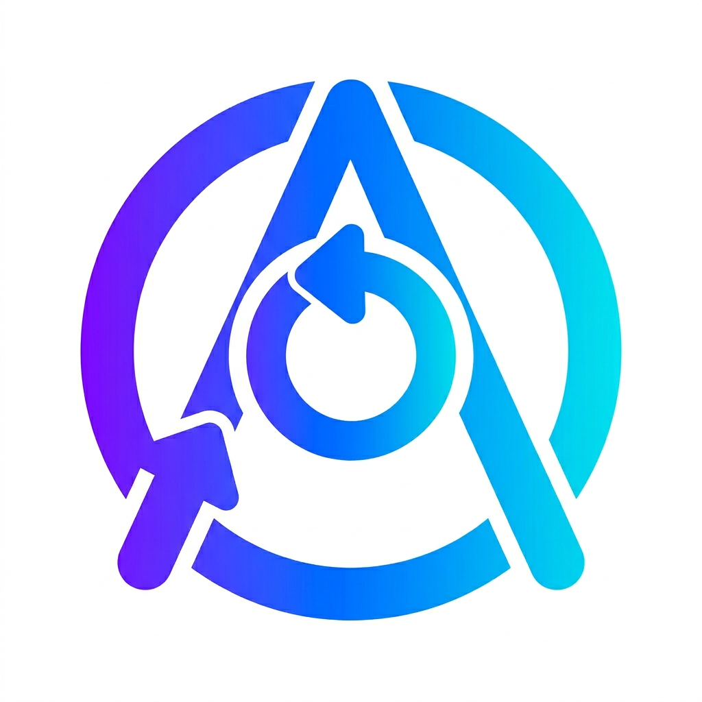

<div align="center">
	
	<h1>AgentSync</h1>
	<h3><em>Encrypted sync for AI agent configuration.</em></h3>
</div>

<p align="center">
	<strong>Snapshot, redact, encrypt, and restore Claude, Cursor, Codex, Copilot, and VS Code setup from a Git-backed vault.</strong>
</p>

<p align="center">
	<a href="https://github.com/chrisleekr/agentsync/releases/latest"></a>
	<a href="https://github.com/chrisleekr/agentsync/stargazers"></a>
	<a href="https://github.com/chrisleekr/agentsync/blob/main/LICENSE"></a>
	<a href="./docs/development.md"></a>
</p>

AgentSync is a Bun-based CLI and background daemon that snapshots AI agent configuration from your machine, encrypts it with age recipients, and stores it in a Git-backed vault so you can pull the same setup onto another machine.

It is for people who keep global agent configuration in tools like Claude, Cursor, Codex, Copilot, and VS Code and want one encrypted source of truth instead of manually copying files between laptops.

## Released CLI path

Use the published package path only after a tagged GitHub Release and npm publish have both completed for the version you want.

Use this path when you are evaluating or operating a published AgentSync release.
If you are developing from a local clone or testing unreleased changes, use the contributor-from-source workflow instead.

Prerequisites for the released CLI path:

- Bun 1.3.9 or later
- A published AgentSync package for the version you want to run

First-run verification command for the published CLI:

```bash
bunx --package @chrisleekr/agentsync agentsync --version
```

Run the published CLI with `bunx` when you do not want a separate global install:

```bash
bunx --package @chrisleekr/agentsync agentsync <command> [options]
```

Common `bunx` examples:

```bash
# Verify the published CLI resolves correctly
bunx --package @chrisleekr/agentsync agentsync --version

# Initialize a vault from the published package
bunx --package @chrisleekr/agentsync agentsync init --remote git@github.com:<you>/agentsync-vault.git --branch main

# Push local agent config into the encrypted vault
bunx --package @chrisleekr/agentsync agentsync push

# Pull the latest vault state onto this machine
bunx --package @chrisleekr/agentsync agentsync pull
```

Use the GitHub Release record as the canonical place to see:

- which version you are installing
- what changed in that release

Start here:

- [Latest release](https://github.com/chrisleekr/agentsync/releases/latest)
- [All releases](https://github.com/chrisleekr/agentsync/releases)

## What a vault means here

The vault is a normal Git repository that stores encrypted artifacts such as `claude/CLAUDE.md.age` or `copilot/skills/<name>.tar.age`. AgentSync never pushes plaintext configs. Files that match hard never-sync patterns or contain literal secrets abort the push before encryption.

## Current implementation status

Currently supported:

- Local config loading, schema validation, and vault path resolution
- age recipient management for machine-based encryption
- Push, pull, status, doctor, daemon, and key CLI entry points
- Agent snapshot and apply flows for Claude, Cursor, Codex, Copilot, and VS Code
- Secret redaction and never-sync enforcement before artifacts reach the vault

Not yet positioned as a full hosted service:

- No remote conflict UI beyond the CLI flow
- No web dashboard or multi-user admin surface
- No runtime API server outside the local daemon IPC channel

## Prerequisites

- Bun 1.3.9 or later
- A Git remote you control for the encrypted vault
- An age keypair managed by AgentSync or migrated into the local key path
- One or more supported agent config directories on the machine you are syncing
- macOS, Linux, or Windows for daemon installation paths described in the docs

## Contributor setup from source

This is the contributor workflow for developing from a clone of the repository. It is separate from the published CLI path above.

Do not use this section when you are trying to run a published release from npm.
For released usage, start with the released CLI path above and continue in [docs/command-reference.md](docs/command-reference.md).

If your change follows the spec-kit workflow, start with [docs/speckit.md](docs/speckit.md).
If you are maintaining the repo-local speckit setup itself, use
[docs/speckit-local-development.md](docs/speckit-local-development.md).

Install dependencies and verify the repo first:

```bash
bun install
bun run check
```

Initialize a vault and machine key:

```bash
bun run src/cli.ts init --remote git@github.com:<you>/agentsync-vault.git --branch main
```

Push local agent configs into the encrypted vault:

```bash
bun run src/cli.ts push
```

Pull the vault back onto this machine or a new one:

```bash
bun run src/cli.ts pull
```

## Command summary

| Command  | Why you run it                                                                   |
| -------- | -------------------------------------------------------------------------------- |
| `init`   | Create the local vault workspace, key, config, and initial remote state          |
| `push`   | Snapshot local agent configs, redact secrets, encrypt artifacts, and push to Git |
| `pull`   | Pull the latest vault state and apply decrypted artifacts locally                |
| `status` | Compare local files with the vault and surface drift                             |
| `doctor` | Run environment, key, vault, and daemon diagnostics                              |
| `daemon` | Install or manage background auto-sync                                           |
| `key`    | Add recipients or rotate the local machine key                                   |

## Documentation

- [Speckit guide](docs/speckit.md): start or continue feature work through the repo's spec-kit workflow
- [Speckit local development guide](docs/speckit-local-development.md): prompt-file locations, active-feature detection, timestamp branches, and workflow upkeep rules
- [Development guide](docs/development.md): contributor setup, local workflow, and verification steps
- [Architecture guide](docs/architecture.md): module map, sync flow, security boundaries, and daemon design
- [Maintenance guide](docs/maintenance.md): release upkeep, OIDC-only publish rules, and documentation/JSDoc change policy
- [Command reference](docs/command-reference.md): released CLI install path, command usage, prerequisites, caveats, and release-info lookup
- [Troubleshooting guide](docs/troubleshooting.md): common setup, key, remote, and daemon failures with next actions

## Safety notes

- Treat the private key file as recoverability-critical material. Back it up outside the vault.
- Do not paste literal API keys or tokens into synced config. AgentSync aborts pushes when it detects them.
- Use the command reference and troubleshooting guide when a workflow is partially supported or platform-specific instead of assuming parity across all agents.

## Next steps

If you are evaluating the released CLI path, start with the [latest release](https://github.com/chrisleekr/agentsync/releases/latest) and then [docs/command-reference.md](docs/command-reference.md).
If you are developing from source, start with [docs/development.md](docs/development.md).
If you are doing feature planning or workflow work through spec-kit, start with [docs/speckit.md](docs/speckit.md).
If you want the system model before changing code, read [docs/architecture.md](docs/architecture.md).
If you are modifying commands or agent integrations, read [docs/maintenance.md](docs/maintenance.md) before opening a PR.
