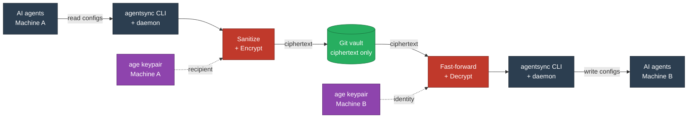
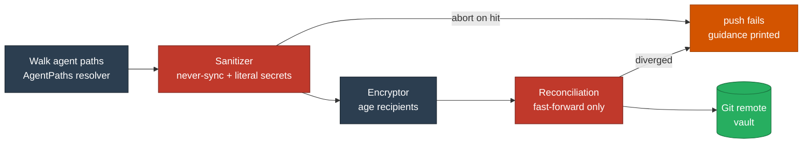
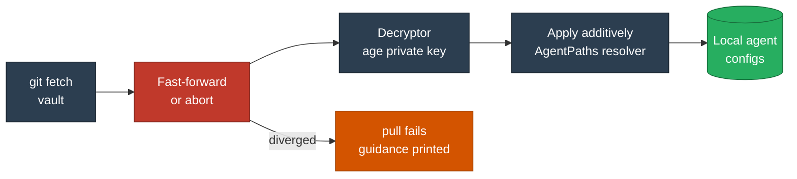

# Architecture Overview

A bird's-eye view of how AgentSync moves bytes from your machine to a
Git remote and back. For internals — encryptor format, watcher
plumbing, IPC protocol — read [the deep dive](architecture.md).

## System context

The diagram below shows the major actors and the trust boundaries
between them. **Plaintext never crosses the network**; the Git remote
only ever sees ciphertext blobs and metadata.

The dark slate nodes (Machine A and Machine B) live inside their
respective trust boundaries — plaintext never crosses out. The purple
key nodes sit alongside their machine because the age private key is
local-only. The two red **gates** are where every push and pull is
forced through sanitize/encrypt and fast-forward/decrypt; bypassing
them is not a supported path. The green **vault** sees only ciphertext.

## The push pipeline

When you run `agentsync push` (or the daemon fires one), bytes flow
through four gates in order. Any gate can abort the entire push — there
is no partial state in the vault.

## Why these specific gates?

| Gate | What it enforces | Why it's non-negotiable |
|---|---|---|
| **Sanitizer** | Never-sync patterns + literal-secret detection | One leaked API key in the vault is one too many. Aborting beats encrypting a secret that future-you might decrypt and paste. |
| **Encryptor** | All vault writes go through `src/core/encryptor.ts` | Defence in depth — if Git history leaks, ciphertext-only is the difference between "annoying" and "catastrophic". |
| **Fast-forward only** | Refuse merges, even trivial ones | Two machines pushing concurrently produce *encrypted* diffs that can't be diff-merged meaningfully. Recovery via `pull` then re-push is the only safe move. |

## The pull pipeline

`pull` is **additive by construction** — it can add files and update
existing ones, but it never deletes. Skill removal is explicit
(`agentsync skill remove`) precisely so a misconfigured pull on a fresh
machine can never wipe local work.

## Where to look in the source

| Concept | File |
|---|---|
| Per-agent path resolution | `src/config/paths.ts` |
| Sanitizer | `src/core/sanitizer.ts` |
| Encryptor / decryptor | `src/core/encryptor.ts` |
| Fast-forward reconciliation | `src/core/git.ts` |
| Watcher + sync queue | `src/core/watcher.ts`, `src/core/sync-queue.ts` |
| Daemon entry | `src/daemon/` |
| CLI commands | `src/commands/` |

Ready for the full picture? Continue to the [Architecture Deep
Dive](architecture.md).
