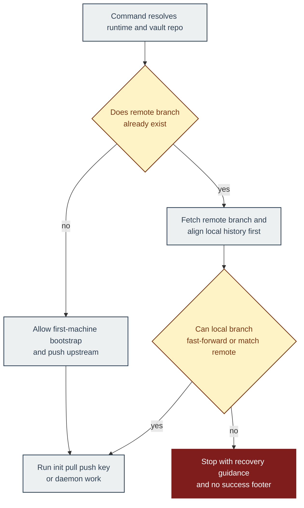
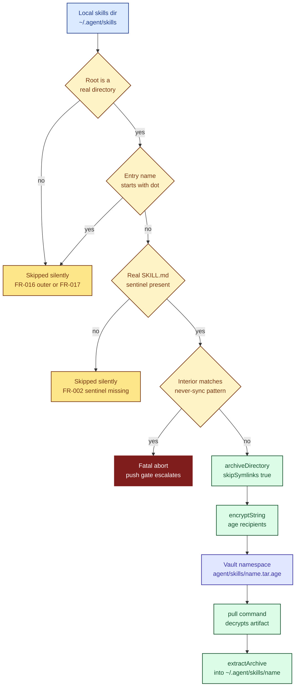
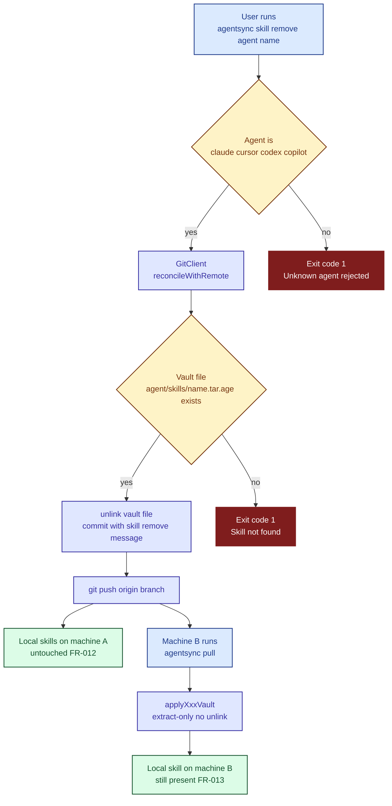

# Architecture Guide

## Purpose

This guide explains how AgentSync moves local agent configuration into an encrypted vault and back again so contributors can reason about the system without reverse-engineering file paths and control flow.

## High-level model

AgentSync has three main layers:

1. CLI commands under `src/commands/` that orchestrate user-facing workflows.
2. Agent adapters under `src/agents/` that snapshot local config into vault artifacts and apply vault artifacts back onto the machine.
3. Core services under `src/core/` and `src/config/` that handle encryption, sanitization, Git operations, IPC, tar archives, watchers, and platform path resolution.

## Core concepts

- **Vault**: A Git repository containing encrypted `.age` and `.tar.age` artifacts.
- **Snapshot**: The read side that turns local config into `Artifact[]` plus warnings.
- **Apply**: The write side that decrypts vault artifacts and upserts them onto the local machine.
- **Recipient**: An age public key listed in `agentsync.toml`. The vault is encrypted for all configured recipients.
- **Never-sync patterns**: Hard exclusions in `src/core/sanitizer.ts` that block sensitive files before encryption.
- **Redaction**: Secret detection that aborts the push if literal credentials appear in supported config content.
- **Reconciliation policy**: A shared fast-forward-only Git rule in `src/core/git.ts` that decides whether sync work may continue.

## Reconciliation flow

`init` uses this flow to distinguish first-machine bootstrap from second-machine join behavior.
`pull`, `push`, `key add`, `key rotate`, and daemon-triggered sync all reuse the same reconciliation check before they apply, encrypt, or rewrite vault content.

## Main flow

### Push

1. `src/commands/push.ts` resolves runtime paths and loads `agentsync.toml`.
2. It snapshots enabled agents via the registry in `src/agents/registry.ts`.
3. It aborts early if snapshot warnings show literal secrets.
4. It encrypts each artifact with all configured recipients.
5. It reconciles with the remote using the shared fast-forward-only rule in `src/core/git.ts`.
6. It commits and pushes the resulting vault changes through `src/core/git.ts`.

### Pull

1. `src/commands/pull.ts` resolves runtime paths, loads config, and reads the private key.
2. It reconciles the local vault branch with the remote using the shared fast-forward-only rule.
3. It dispatches agent apply functions through the registry.
4. Each agent decrypts and writes only its own artifact set.

If the local vault diverged from the remote, the command flow stops before any apply or encryption work begins.

### Status and doctor

- `status` compares local snapshot content with decrypted vault files to show drift.
- `doctor` checks key presence, config validity, remote reachability, vault hygiene, and daemon installation state.

## Skills sync flow

AgentSync treats per-user *skills* — directories under `~/.claude/skills/`, `~/.codex/skills/`, `~/.cursor/skills/`, and `~/.copilot/skills/` — as first-class artifacts. They ride the vault through a single shared module: the skills walker at `src/agents/skills-walker.ts`.

Every skill-bearing agent adapter calls `collectSkillArtifacts(agent, skillsDir)` and inherits the same five gates in the same order. Each gate is a safety rule that maps back to a specific requirement:

1. **Dot-skip** — any entry name starting with `.` is skipped silently. Protects vendor bundles like Codex's `.system/` directory (FR-017).
2. **Root-symlink rejection** — if the skills root itself is a symlink, the walker returns an empty result with no warnings. Protects against a vendored-pool tree being pointed at the skills directory by accident (FR-016 outer tier).
3. **Sentinel verification** — a skill directory must contain a *real* `SKILL.md` file. `lstat` is used so a symlinked sentinel fails naturally without a special case (FR-002 + FR-016 sentinel).
4. **Never-sync interior scan** — every file inside the skill is run through `shouldNeverSync` from `src/core/sanitizer.ts`. Any hit emits a `never-sync inside skill: <path>` warning which `src/commands/push.ts` escalates to a fatal abort, so the entire push fails before any encryption work begins (FR-006).
5. **Symlink-filtered tar** — the surviving skill tree is archived through `archiveDirectory(dir, { skipSymlinks: true })`. Symlinked files inside the skill are filtered out of the tar; the real files around them are archived normally (FR-016 inner tier).

The filter's opt-in flag keeps the pre-existing Copilot agent-tarball code path bit-for-bit unchanged.

### Vault-removal flow

Skills are **additive-by-default** across the whole pipeline. A local delete never removes the vault entry — the only way to take a skill out of the vault is the explicit `agentsync skill remove <agent> <name>` verb at `src/commands/skill.ts`. That verb enforces two invariants: it only touches the vault file, never any local skill directory (FR-012); and any subsequent `pull` on another machine leaves that machine's local skill directory untouched because `applyXxxVault` is extract-only (FR-013).

This two-flow model is why AgentSync can add and remove skills independently on different machines without any central coordination — every removal is an intentional user action, and every pull is extract-only.

## Security boundaries

- `src/core/encryptor.ts` is the boundary for age identity generation, recipient derivation, and string/file encryption.
- `src/core/sanitizer.ts` is the single source of truth for secret detection and never-sync path rules.
- `src/core/tar.ts` exists because some agent assets are directory-shaped and need archive transport rather than line-by-line file sync.
- Private keys stay on disk in the local runtime directory and must never be committed or logged.

## Daemon model

- `src/daemon/index.ts` runs the background process.
- It exposes `status`, `push`, and `pull` over the newline-delimited IPC protocol in `src/core/ipc.ts`.
- It watches selected agent directories and auto-pushes after a debounce window.
- It also runs periodic pull on the configured interval.
- Platform installers in `src/daemon/installer-macos.ts`, `src/daemon/installer-linux.ts`, and `src/daemon/installer-windows.ts` create the service wrapper appropriate for each OS.

## Platform-specific paths

Path differences are centralized in `src/config/paths.ts`. That file maps supported agent locations and runtime paths for macOS, Linux, and Windows, including:

- Claude config and command directories
- Cursor MCP config and rules field location
- Codex home and rule directories
- Copilot instructions, prompts, skills, and agents directories
- VS Code MCP config path
- AgentSync runtime home and daemon socket path

## Support-state reminder

The current repo supports the local CLI and daemon model. It does not provide a hosted sync service, web administration surface, or conflict-resolution UI outside the command flow.

## Related docs

- [development.md](development.md) for local setup and validation
- [command-reference.md](command-reference.md) for user-facing command behavior
- [maintenance.md](maintenance.md) for update rules and documentation gates
- [troubleshooting.md](troubleshooting.md) for setup and daemon failures
