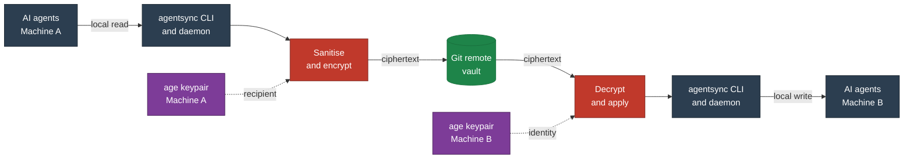
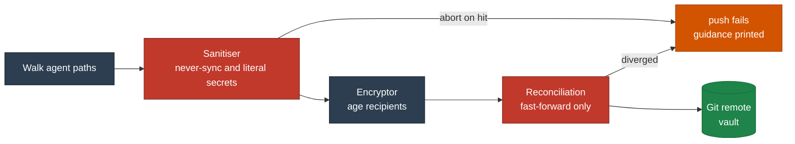
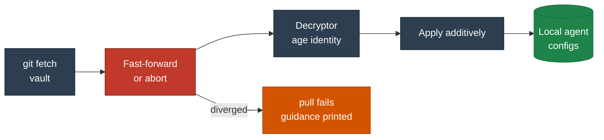
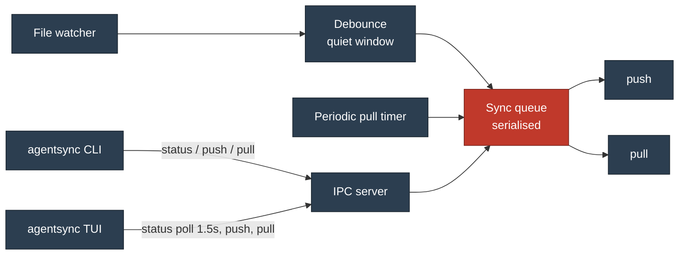

# Architecture

How AgentSync moves bytes from your machine to a Git remote and back, encrypted end-to-end, with reconciliation that fails closed.

## What this page owns

This page owns the system model, the push and pull pipelines, the daemon model, the vault layout, the security boundaries, and the reconciliation rule. Command flags live in [Commands](commands.md); day-2 operational concerns live in [Operations](operations.md).

## System context

The diagram shows the major actors and the trust boundaries between them. **Plaintext never crosses the network.** The Git remote only ever sees ciphertext blobs and metadata.

<div class="agentsync-darknodes" markdown>


```mermaid
flowchart LR
    AgentsA["AI agents<br/>Machine A"]:::local
    CliA["agentsync CLI<br/>and daemon"]:::local
    KeyA["age keypair<br/>Machine A"]:::key
    SanEncA["Sanitise<br/>and encrypt"]:::gate
    VaultRemote[("Git remote<br/>vault")]:::remote
    SanEncB["Decrypt<br/>and apply"]:::gate
    KeyB["age keypair<br/>Machine B"]:::key
    CliB["agentsync CLI<br/>and daemon"]:::local
    AgentsB["AI agents<br/>Machine B"]:::local

    AgentsA -->|local read| CliA
    CliA --> SanEncA
    KeyA -.recipient.-> SanEncA
    SanEncA -->|ciphertext| VaultRemote
    VaultRemote -->|ciphertext| SanEncB
    KeyB -.identity.-> SanEncB
    SanEncB --> CliB
    CliB -->|local write| AgentsB

    classDef local fill:#2c3e50,color:#ffffff,stroke:#1a252f
    classDef key fill:#7d3c98,color:#ffffff,stroke:#4a235a
    classDef gate fill:#c0392b,color:#ffffff,stroke:#7b241c
    classDef remote fill:#1e8449,color:#ffffff,stroke:#196f3d
```

</div>

The three things to internalise:

1. The CLI and daemon are the only components that ever hold plaintext.
2. The age keypair lives only on its own machine. Adding a machine means adding its public key to the recipient list, not sharing private material.
3. The Git remote is fully replaceable. Any host that can serve a Git repository works. The remote learns nothing about the configuration it stores.

## The push pipeline

When you run `agentsync push` (or the daemon fires one), bytes flow through four gates in order. Any gate can abort the entire push. There is no partial state in the vault.

<div class="agentsync-darknodes" markdown>


```mermaid
flowchart LR
    Walk["Walk agent paths"]:::step
    Sanitize["Sanitiser<br/>never-sync and literal secrets"]:::gate
    Encrypt["Encryptor<br/>age recipients"]:::step
    Reconcile["Reconciliation<br/>fast-forward only"]:::gate
    Remote[("Git remote<br/>vault")]:::remote
    Abort["push fails<br/>guidance printed"]:::abort

    Walk --> Sanitize
    Sanitize -->|abort on hit| Abort
    Sanitize --> Encrypt
    Encrypt --> Reconcile
    Reconcile -->|diverged| Abort
    Reconcile --> Remote

    classDef step fill:#2c3e50,color:#ffffff,stroke:#1a252f
    classDef gate fill:#c0392b,color:#ffffff,stroke:#7b241c
    classDef remote fill:#1e8449,color:#ffffff,stroke:#196f3d
    classDef abort fill:#d35400,color:#ffffff,stroke:#a04000
```

</div>

Gate-by-gate:

- **Walk**: the per-agent path resolver enumerates every artefact the agent owns on disk. Hidden entries, symlinked roots, and dot-prefixed names are filtered before any content is read.
- **Sanitiser**: the single source of truth for never-sync paths and literal-secret detection. A hit is a hard stop. The push prints which file and which rule, and the vault is never touched.
- **Encryptor**: every artefact is encrypted to the current recipient set using age. Plaintext exists only in process memory and is never serialised to disk after this point.
- **Reconciliation**: fast-forward only. If the local vault has diverged from the remote branch, the push stops and prints a recovery path. AgentSync never merges silently.

## The pull pipeline

Pull is **additive by construction**. It can add files and update existing ones; it never deletes a local file the vault does not contain. Skill removal is explicit (`agentsync skill remove`) precisely so a misconfigured pull on a fresh machine cannot wipe local work.

<div class="agentsync-darknodes" markdown>


```mermaid
flowchart LR
    Fetch["git fetch<br/>vault"]:::step
    FF["Fast-forward<br/>or abort"]:::gate
    Decrypt["Decryptor<br/>age identity"]:::step
    Apply["Apply additively"]:::step
    Local[("Local agent<br/>configs")]:::remote
    Abort["pull fails<br/>guidance printed"]:::abort

    Fetch --> FF
    FF -->|diverged| Abort
    FF --> Decrypt
    Decrypt --> Apply
    Apply --> Local

    classDef step fill:#2c3e50,color:#ffffff,stroke:#1a252f
    classDef gate fill:#c0392b,color:#ffffff,stroke:#7b241c
    classDef remote fill:#1e8449,color:#ffffff,stroke:#196f3d
    classDef abort fill:#d35400,color:#ffffff,stroke:#a04000
```

</div>

`status` and `doctor` ride on top of the same primitives but never write. `status` compares a fresh local snapshot to the decrypted vault state. `doctor` checks key presence, config validity, remote reachability, vault hygiene, and daemon installation state.

## Reconciliation rule

Reconciliation is fast-forward only and is the **same rule** used by `init`, `push`, `pull`, `key add`, `key rotate`, and the daemon. The contract:

- If the local branch is identical to the remote branch, the operation continues.
- If the local branch is behind the remote, the operation fast-forwards the local before continuing.
- If the local branch is ahead of the remote, the operation pushes after the local step completes.
- If the local branch has diverged from the remote, the operation stops with a printed recovery path. AgentSync never merges or rebases automatically.

The reasoning: a configuration vault is a flat record of intent. Three-way merge on encrypted blobs would either produce nonsense or require trust in a merge driver that has no way to inspect the plaintext. Failing closed forces the human to decide which branch is canonical.

See [Recover from divergence](operations.md#recover-from-divergence) for the runbook.

## Vault layout

The vault is a regular Git repository. Inside it, every artefact is suffixed with `.age` and is age-encrypted to the recipient set defined in `agentsync.toml`. The on-disk layout is namespaced per agent:

```text
<vault-root>/
├── agentsync.toml                 # recipient list, branch, remote, sync options
├── claude/
│   ├── settings.json.age
│   ├── hooks.json.age
│   ├── mcp.json.age
│   ├── marketplace.json.age       # only when claudePlugins.syncMarketplace = true
│   ├── commands/
│   │   └── <name>.md.age
│   ├── skills/
│   │   └── <name>.tar.age         # tar bundle per skill
│   └── plugins/
│       └── <name>/                # one subtree per Claude plugin
│           ├── plugin.json.age
│           ├── commands/<name>.md.age
│           ├── agents/<name>.md.age
│           ├── hooks/<name>.json.age
│           └── mcp.json.age
├── codex/
│   ├── AGENTS.md.age
│   └── skills/<name>.tar.age
├── cursor/
│   ├── settings.json.age
│   ├── rules/<name>.mdc.age
│   └── skills/<name>.tar.age
└── copilot/
    ├── instructions.md.age
    └── skills/<name>.tar.age
```

Skill bundles are tar archives so directory-shaped assets round-trip cleanly. Plugins under `claude/plugins/<name>/` are first-class subtrees so installing a Claude plugin on one machine and pulling on another reproduces every artefact under the same plugin namespace.

`marketplace.json.age` is only emitted, and only applied on pull, when `claudePlugins.syncMarketplace = true` is set in `agentsync.toml` on both machines. The default is false so a vault snapshot does not silently propagate a Claude marketplace opt-in.

## Skills and plugins

Skills and plugins follow the same walker contract on every agent:

- A missing or symlinked root is skipped silently (it is a legitimate "this agent has no skills directory" signal, not a failure).
- Dot-prefixed names are skipped silently (hidden directories belong to other tools).
- A name that fails validation (containing `..`, separators, control characters, or the reserved `.` / `..`) is rejected with a printed error. Validation guards every place a name becomes a filesystem path.
- A Claude plugin must contain a real `.claude-plugin/plugin.json` file (lstat-checked, so symlinked manifests are rejected) before any of its assets are emitted.

Once admitted, each artefact is sanitised through the relevant rule set, encrypted, and emitted to its vault path. Sanitiser warnings about redacted secrets are surfaced in the push output so the user knows their literal credential was rejected rather than silently scrubbed.

## Daemon model

The daemon is a long-running process under platform supervision (launchd on macOS, systemd-user on Linux, Task Scheduler on Windows). It exposes `status`, `push`, and `pull` over a newline-delimited IPC protocol on a per-user socket.

<div class="agentsync-darknodes" markdown>


```mermaid
flowchart LR
    Watcher["File watcher"]:::step
    Debounce["Debounce<br/>quiet window"]:::step
    Queue["Sync queue<br/>serialised"]:::gate
    Push["push"]:::step
    Pull["pull"]:::step
    Timer["Periodic pull timer"]:::step
    Ipc["IPC server"]:::step
    Cli["agentsync CLI"]:::local
    Tui["agentsync TUI"]:::local

    Watcher --> Debounce --> Queue
    Timer --> Queue
    Cli -->|status / push / pull| Ipc
    Tui -->|status poll 1.5s, push, pull| Ipc
    Ipc --> Queue
    Queue --> Push
    Queue --> Pull

    classDef local fill:#2c3e50,color:#ffffff,stroke:#1a252f
    classDef step fill:#2c3e50,color:#ffffff,stroke:#1a252f
    classDef gate fill:#c0392b,color:#ffffff,stroke:#7b241c
```

</div>

The IPC server accepts multiple concurrent clients. A TUI session and a
flag-driven CLI invocation can be open at the same time without conflicting
because every request goes through the same sync queue.

Key invariants:

- **Only one daemon per user.** Second-instance detection runs at startup and exits cleanly if a daemon is already up. A stale socket from an ungraceful prior exit is unlinked automatically.
- **One sync at a time.** Every push and pull, whether file-watcher-driven, timer-driven, or IPC-driven, passes through the sync queue. Two operations can never race.
- **One automatic retry.** A transient sync failure triggers one retry. If both attempts fail, the error is recorded and the daemon stays alive so the next change can trigger a fresh push. The daemon never silently gives up.
- **Hard shutdown timeout.** On shutdown the queue is drained with a ten-second hard timeout. The IPC socket and watchers are released cleanly.

Daemon installation paths per OS, log locations, and the configuration table live in [Operations](operations.md#daemon).

## Security boundaries

Three places own the security contract:

- **Encryptor**: the only path that generates age identities, derives recipients, and encrypts content. Plaintext never leaves this layer for any artefact going to disk or to the network.
- **Sanitiser**: the only place that decides what is safe to encrypt. Never-sync paths and literal-secret detection are hard-coded rules, not opt-in policy. Loosening either requires a documented reason.
- **Tar bundler**: exists because some agent assets are directory-shaped. The tar is built in memory before encryption so an intermediate plaintext archive never lands on disk.

Private keys stay on disk in the local runtime directory (`~/.config/agentsync/key.txt` by default on Unix, with restrictive permissions). They are never committed and never logged.

## Path resolution

Every agent path is resolved through a single resolver that maps `<agent>.<dir>` to an absolute path on the current OS. Tests and platform overrides drive the resolver through environment variables rather than rewriting paths inline. The consequence: AgentSync runs identically inside the Docker E2E harness, on a developer laptop, and in CI, with no platform-specific branches in the call sites.

## Vault format versioning

The vault has a format version recorded in `agentsync.toml`. Backwards-incompatible changes (a renamed namespace, a new sanitiser rule that would reject already-published content, a new encryption-recipient encoding) require a migration step. Each migration is recorded under `src/migrate/` and is documented in [Migrate](migrate.md). AgentSync refuses to push to a vault whose format version is newer than the CLI understands.

## Source map

If you are reading the code, this is the rough mapping from concept to module. Keep this list short and link by responsibility rather than file path so renames do not silently invalidate it.

| Concept | Owning module |
|---|---|
| Encryption, identity, recipient derivation | `src/core/encryptor.ts` |
| Sanitiser rules and literal-secret detection | `src/core/sanitizer.ts` |
| Tar bundling for directory-shaped artefacts | `src/core/tar.ts` |
| Fast-forward reconciliation rule | `src/core/git.ts` |
| Sync queue and IPC protocol | `src/core/sync-queue.ts`, `src/core/ipc.ts` |
| File watcher | `src/core/watcher.ts` |
| Daemon entry point | `src/daemon/index.ts` |
| Per-OS daemon installers | `src/daemon/installer-macos.ts`, `installer-linux.ts`, `installer-windows.ts` |
| Per-agent snapshot and apply | `src/agents/<agent>/` |
| Path resolution | `src/config/paths.ts` |
| Config schema (`agentsync.toml`) | `src/config/schema.ts` |
| Vault format migrations | `src/migrate/` |
| Interactive TUI (bare `agentsync`) | `src/commands/tui/` |

## Compiled-binary packaging

The TUI uses [OpenTUI](https://github.com/anomalyco/opentui), whose
TypeScript wrapper around a native Zig core is loaded through `bun:ffi` at
runtime. Three packaging consequences follow:

- `bun run build` (the compiled binary at `dist/agentsync`) runs through
  `scripts/build.ts`, which first executes `bun install --os="*" --cpu="*"
  @opentui/core@<v>` so every platform's optional native dependency is
  resolved into `node_modules` before `bun build --compile` embeds the
  matching one into bunfs.
- `bun run build:package` (the npm-published bundle at `dist/cli.js`)
  externalises `@opentui/core` so the single-file bundle stays a single
  file. npm consumers receive `@opentui/core` as a runtime dependency
  declared in `package.json`.
- Local development (`bun run src/cli.ts`) needs neither step — Bun
  resolves the native lib for the host platform on first import.
