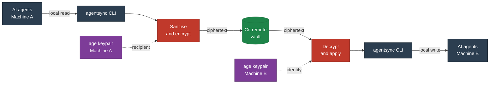
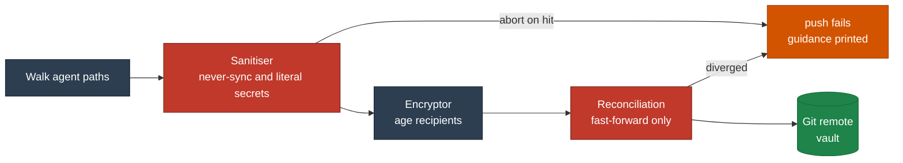
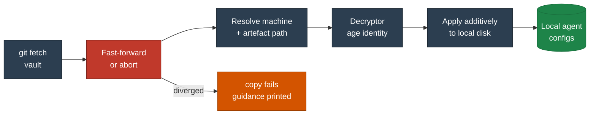
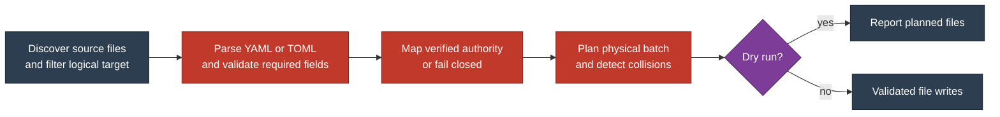

# Architecture

How AgentSync moves bytes from your machine to a Git remote and back, encrypted end-to-end, with reconciliation that fails closed.

## What this page owns

This page owns the system model, the push and copy pipelines, the vault layout, the security boundaries, and the reconciliation rule. Command flags live in [Commands](commands.md); day-2 operational concerns live in [Operations](operations.md).

## System context

The diagram shows the major actors and the trust boundaries between them. **Plaintext never crosses the network.** The Git remote only ever sees ciphertext blobs and metadata.

<div class="agentsync-darknodes" markdown>


```mermaid
flowchart LR
    AgentsA["AI agents<br/>Machine A"]:::local
    CliA["agentsync CLI"]:::local
    KeyA["age keypair<br/>Machine A"]:::key
    SanEncA["Sanitise<br/>and encrypt"]:::gate
    VaultRemote[("Git remote<br/>vault")]:::remote
    SanEncB["Decrypt<br/>and apply"]:::gate
    KeyB["age keypair<br/>Machine B"]:::key
    CliB["agentsync CLI"]:::local
    AgentsB["AI agents<br/>Machine B"]:::local

    AgentsA -->|local read| CliA
    CliA --> SanEncA
    KeyA -.recipient.-> SanEncA
    SanEncA -->|ciphertext| VaultRemote
    VaultRemote -->|ciphertext| SanEncB
    KeyB -.identity.-> SanEncB
    SanEncB --> CliB
    CliB -->|local write| AgentsB

    classDef local fill:#2c3e50,color:#ffffff,stroke:#1a252f
    classDef key fill:#7d3c98,color:#ffffff,stroke:#4a235a
    classDef gate fill:#c0392b,color:#ffffff,stroke:#7b241c
    classDef remote fill:#1e8449,color:#ffffff,stroke:#196f3d
```

</div>

The three things to internalise:

1. The CLI is the only component that ever holds plaintext.
2. The age keypair lives only on its own machine. Adding a machine means adding its public key to the recipient list, not sharing private material.
3. The Git remote is fully replaceable. Any host that can serve a Git repository works. The remote learns nothing about the configuration it stores.

## The push pipeline

When you run `agentsync push`, bytes flow through four gates in order. Any gate can abort the entire push. There is no partial state in the vault.

<div class="agentsync-darknodes" markdown>


```mermaid
flowchart LR
    Walk["Walk agent paths"]:::step
    Sanitize["Sanitiser<br/>never-sync and literal secrets"]:::gate
    Encrypt["Encryptor<br/>age recipients"]:::step
    Reconcile["Reconciliation<br/>fast-forward only"]:::gate
    Remote[("Git remote<br/>vault")]:::remote
    Abort["push fails<br/>guidance printed"]:::abort

    Walk --> Sanitize
    Sanitize -->|abort on hit| Abort
    Sanitize --> Encrypt
    Encrypt --> Reconcile
    Reconcile -->|diverged| Abort
    Reconcile --> Remote

    classDef step fill:#2c3e50,color:#ffffff,stroke:#1a252f
    classDef gate fill:#c0392b,color:#ffffff,stroke:#7b241c
    classDef remote fill:#1e8449,color:#ffffff,stroke:#196f3d
    classDef abort fill:#d35400,color:#ffffff,stroke:#a04000
```

</div>

Gate-by-gate:

- **Walk**: the per-agent path resolver enumerates every artefact the agent owns on disk. Hidden entries, symlinked roots, and dot-prefixed names are filtered before any content is read.
- **Sanitiser**: the single source of truth for never-sync paths and literal-secret detection. A hit is a hard stop. The push prints which file and which rule, and the vault is never touched.
- **Encryptor**: every artefact is encrypted to the current recipient set using age. Plaintext exists only in process memory and is never serialised to disk after this point.
- **Reconciliation**: fast-forward only. If the local vault has diverged from the remote branch, the push stops and prints a recovery path. AgentSync never merges silently.

## The copy pipeline

There is no automatic down-sync. `push` only ever writes this machine's own `machines/<name>/` namespace; the **only** way to bring vault content onto local disk is an explicit `agentsync copy <machine> <path>`. You name the source machine and the artefact (or a directory prefix), and AgentSync decrypts just that and applies it to local disk through the same per-agent apply plan a snapshot uses.

Copy is **additive by construction**. It can add files and update existing ones; it never deletes a local file the vault does not contain. Skill removal is explicit (`agentsync skill remove`) precisely so a misconfigured copy on a fresh machine cannot wipe local work. Copy writes only local disk — it never touches the vault, so the next `push` captures the result normally.

<div class="agentsync-darknodes" markdown>


```mermaid
flowchart LR
    Fetch["git fetch<br/>vault"]:::step
    FF["Fast-forward<br/>or abort"]:::gate
    Pick["Resolve machine<br/>+ artefact path"]:::step
    Decrypt["Decryptor<br/>age identity"]:::step
    Apply["Apply additively<br/>to local disk"]:::step
    Local[("Local agent<br/>configs")]:::remote
    Abort["copy fails<br/>guidance printed"]:::abort

    Fetch --> FF
    FF -->|diverged| Abort
    FF --> Pick
    Pick --> Decrypt
    Decrypt --> Apply
    Apply --> Local

    classDef step fill:#2c3e50,color:#ffffff,stroke:#1a252f
    classDef gate fill:#c0392b,color:#ffffff,stroke:#7b241c
    classDef remote fill:#1e8449,color:#ffffff,stroke:#196f3d
    classDef abort fill:#d35400,color:#ffffff,stroke:#a04000
```

</div>

`status` and `doctor` ride on top of the same primitives but never write. `status` compares a fresh local snapshot to the decrypted vault state. `doctor` checks key presence, config validity, remote reachability, and vault hygiene.

## Reconciliation rule

Reconciliation is fast-forward only and is the **same rule** used by `init`, `push`, `copy`, `key add`, and `key rotate`. The contract:

- If the local branch is identical to the remote branch, the operation continues.
- If the local branch is behind the remote, the operation fast-forwards the local before continuing.
- If the local branch is ahead of the remote, `push` fast-forwards the remote; `copy` continues reading without writing the remote (copy never pushes).
- If the local branch has diverged from the remote, the operation stops with a printed recovery path. AgentSync never merges or rebases automatically.

The reasoning: a configuration vault is a flat record of intent. Three-way merge on encrypted blobs would either produce nonsense or require trust in a merge driver that has no way to inspect the plaintext. Failing closed forces the human to decide which branch is canonical.

See [Recover from divergence](operations.md#recover-from-divergence) for the runbook.

## Vault layout

The vault is a regular Git repository. Inside it, every artefact is suffixed with `.age` and is age-encrypted to the recipient set defined in `agentsync.toml`. As of vault format v2 the layout is namespaced per machine, then per agent: each machine backs up into its own `machines/<name>/` directory so one machine never overwrites another's. The vault-global `agentsync.toml` stays at the root.

```text
<vault-root>/
├── agentsync.toml                 # version, recipient list, branch, remote, sync options
└── machines/
    └── <name>/                    # one directory per machine (its own backup namespace)
        ├── claude/
        │   ├── settings.hooks.json.age
        │   ├── claude.json.age
        │   ├── plugins.manifest.json.age  # only when claudePlugins.syncPlugins = true
        │   ├── commands/
        │   │   └── <name>.md.age
        │   └── skills/
        │       └── <name>.tar.age      # tar bundle per skill
        ├── codex/
        │   ├── AGENTS.md.age
        │   └── skills/<name>.tar.age
        ├── cursor/
        │   ├── settings.json.age
        │   ├── rules/<name>.mdc.age
        │   └── skills/<name>.tar.age
        └── copilot/
            ├── instructions.md.age
            └── skills/<name>.tar.age
```

Skill bundles are tar archives so directory-shaped assets round-trip cleanly.

Claude plugins are not stored as an encrypted tree. The marketplace is the source of truth, so `push` distils `~/.claude/plugins/installed_plugins.json` + `known_marketplaces.json` into a single `plugins.manifest.json.age` recording each plugin's `name@marketplace`, scope, and enabled flag (machine-specific absolute paths are dropped). `agentsync plugin install <machine>` reinstalls from that manifest by shelling out to the `claude` CLI. The manifest is never applied on pull — a `copy` sweep skips it — so reinstall is always an explicit step. It is only emitted when `claudePlugins.syncPlugins = true`, because the manifest can reference third-party marketplaces. Tradeoff: reinstall fetches the latest version (no pin), and local edits to plugin files are not preserved.

## Skills and plugins

Skills follow the same walker contract on every agent (Claude plugins are manifest-only — see above):

- A missing or symlinked root is skipped silently (it is a legitimate "this agent has no skills directory" signal, not a failure).
- Dot-prefixed names are skipped silently (hidden directories belong to other tools).
- A name that fails validation (containing `..`, separators, control characters, a leading dash, or the reserved `.` / `..`) is rejected with a printed error. Validation guards every place a name becomes a filesystem path or a CLI argument.

Claude plugins are not walked as a file tree. They are represented solely by `plugins.manifest.json.age` (emitted when `claudePlugins.syncPlugins = true`); no plugin asset tree is emitted on push or applied on pull.

Once admitted, each artefact is sanitised through the relevant rule set, encrypted, and emitted to its vault path. Sanitiser warnings about redacted secrets are surfaced in the push output so the user knows their literal credential was rejected rather than silently scrubbed.

## Security boundaries

Three places own the security contract:

- **Encryptor**: the only path that generates age identities, derives recipients, and encrypts content. Plaintext never leaves this layer for any artefact going to disk or to the network.
- **Sanitiser**: the only place that decides what is safe to encrypt. Never-sync paths are hard-coded rules. Literal-secret detection is a **known-credential-format** guard (vendor key prefixes, AWS/GitHub/GitLab/Slack/Google tokens, age identities, PEM private keys, and JWTs in strict mode) — not a general secret scanner: a plain password or bespoke token with no recognised shape is not caught, so encryption, not the scan, is the real protection. The scan's job is to keep well-known credentials out of git history. Its breadth and the base64 redactor are tuned through the `[security]` config, resolved by `securityToPolicy`; the never-sync rules are not configurable. A **catastrophic tier** (the vault's own age key and PEM private keys) blocks the push in every mode and cannot be allow-listed. `secretScan = redact` swaps an ordinary token in structured config for a `$AGENTSYNC_REDACTED_<FIELD>` placeholder and pushes; on apply, `mergePreservingSecrets` keeps a real local value rather than overwrite it with the placeholder.
- **Tar bundler**: exists because some agent assets are directory-shaped. The tar is built in memory before encryption so an intermediate plaintext archive never lands on disk.

Private keys stay on disk in the local runtime directory (`~/.config/agentsync/key.txt` by default on Unix, with restrictive permissions). They are never committed and never logged.

## Path resolution

Every agent path is resolved through a single resolver that maps `<agent>.<dir>` to an absolute path on the current OS. Tests and platform overrides drive the resolver through environment variables rather than rewriting paths inline. The consequence: AgentSync runs identically inside the Docker E2E harness, on a developer laptop, and in CI, without command-implementation sites needing to branch on platform — platform-specific decisions live in `src/config/paths.ts` and nowhere else.

## Cross-agent migration boundary

Cross-agent migration is local-only and separate from encrypted vault snapshots. Custom agents have six logical names but five physical formats because Copilot CLI and VS Code share `~/.copilot/agents/*.agent.md`. The registry contains the 20 directed pairs among Claude, Cursor, Codex, OpenCode, and the shared format; orchestration resolves the VS Code alias and prevents a same-store rewrite. OpenCode remains outside encrypted vault snapshots until its separate vault adapter is implemented.

<div class="agentsync-darknodes" markdown>


```mermaid
flowchart LR
    Discover["Discover source files<br/>and filter logical target"]:::step
    Parse["Parse YAML or TOML<br/>and validate required fields"]:::gate
    Authority["Map verified authority<br/>or fail closed"]:::gate
    Plan["Plan physical batch<br/>and detect collisions"]:::gate
    Preview{"Dry run?"}:::decision
    Report["Report planned files"]:::step
    Write["Validated file writes"]:::step

    Discover --> Parse --> Authority --> Plan --> Preview
    Preview -->|"yes"| Report
    Preview -->|"no"| Write

    classDef step fill:#2c3e50,color:#ffffff,stroke:#1a252f
    classDef gate fill:#c0392b,color:#ffffff,stroke:#7b241c
    classDef decision fill:#7d3c98,color:#ffffff,stroke:#4a235a
```

</div>

Filesystem admission and vendor identity are separate checks. Discovery rejects hidden path segments, symbolic links, and non-files; source read failures other than a missing root abort before writes. Target paths reject traversal, control characters, and non-portable Windows components; target preflight also rejects symlinked agent roots and symlinked or non-file destinations. Vendor parsing then enforces each documented required field without inventing a universal length limit.

Authority translation is intentionally narrow. Exact Claude tool groups map to GitHub capability aliases only when complete; GitHub aliases expand to the applicable full Claude group. Cursor read-only mode maps to Codex's read-only sandbox, and an inherited Codex sandbox maps conservatively only to Cursor read-only. Any authority-bearing field that lacks a verified target equivalent stops that file. Known non-authority loss is reported by field name. A physical target batch is written only after duplicate identities, normalized or case-equivalent target paths, static target type, and shared logical ownership pass preflight. Writes use same-directory flushed temporary files and rename, without promising multi-file rollback or race-free traversal.

## Vault format versioning

The vault carries an integer `version` field in `agentsync.toml`. Format v2 sets `version = 2` and is the per-machine layout (`machines/<name>/…`). The field is the old-binary hard block: a v1 binary's schema expected a string, so it cannot load a v2 vault and write flat dirs beside `machines/`. Loading is two-phase — `peekVaultVersion` reads the raw `version` before the schema runs, so a legacy v1 vault (string or absent `version`) is routed to `agentsync vault upgrade` instead of failing with an opaque error, and an integer above the current version tells the user to upgrade agentsync itself. `agentsync vault upgrade` performs the one-time v1→v2 relocation (distinct from the cross-agent translators under `src/migrate/`, documented in [Migrate](migrate.md)).

## Source map

If you are reading the code, this is the rough mapping from concept to module. Keep this list short and link by responsibility rather than file path so renames do not silently invalidate it.

| Concept | Owning module |
|---|---|
| Encryption, identity, recipient derivation | `src/core/encryptor.ts` |
| Sanitiser rules and literal-secret detection | `src/core/sanitizer.ts` |
| Tar bundling for directory-shaped artefacts | `src/core/tar.ts` |
| Fast-forward reconciliation rule | `src/core/git.ts` |
| Per-agent snapshot and apply | `src/agents/<agent>/` |
| Path resolution | `src/config/paths.ts` |
| Config schema (`agentsync.toml`) | `src/config/schema.ts` |
| Cross-agent configuration migration | `src/migrate/` |
| Vault format migration | `src/commands/vault.ts` |
| Interactive TUI (bare `agentsync`) | `src/commands/tui/` |

## Compiled-binary packaging

The TUI uses [OpenTUI](https://github.com/anomalyco/opentui), whose
TypeScript wrapper around a native Zig core is loaded through `bun:ffi` at
runtime. Three packaging consequences follow:

- `bun run build` (the compiled binary at `dist/agentsync`) runs through
  `scripts/build.ts`, which first executes `bun install --os="*" --cpu="*"
  @opentui/core@<v>` so every platform's optional native dependency is
  resolved into `node_modules` before `bun build --compile` embeds the
  matching one into bunfs.
- `bun run build:package` (the npm-published bundle at `dist/cli.js`)
  externalises `@opentui/core` so the single-file bundle stays a single
  file. npm consumers receive `@opentui/core` as a runtime dependency
  declared in `package.json`.
- Local development (`bun run src/cli.ts`) needs neither step — Bun
  resolves the native lib for the host platform on first import.
