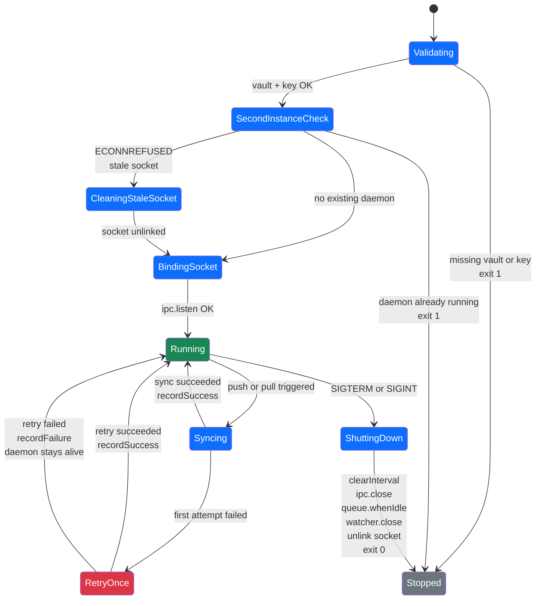

# Daemon Lifecycle

The AgentSync background daemon manages file watchers, periodic pulls, and IPC communication. Below is the state diagram showing all lifecycle transitions.

## Lifecycle Phases

| Phase | Description |
|-------|-------------|
| **Validating** | Checks vault directory, config file, and encryption key are accessible. Exits immediately on failure (FR-006, FR-007, SC-006). |
| **SecondInstanceCheck** | Sends IPC `status` ping to detect a running daemon. Exits if one responds (FR-009). Unlinks stale socket if ECONNREFUSED (FR-003). |
| **Running** | IPC server is listening. File watchers and periodic pull timer are active. Status queries return `{pid, consecutiveFailures, lastError}`. |
| **Syncing** | A push or pull operation is executing inside the `SyncQueue`. All sync operations are serialized — only one runs at a time (FR-015). |
| **RetryOnce** | Automatic single retry after a transient failure (FR-014). If both attempts fail, the error is recorded but the daemon stays alive (SC-004). |
| **ShuttingDown** | Drains the sync queue (10s hard timeout per FR-013), closes IPC, stops watchers, unlinks the socket file, then exits cleanly. |
