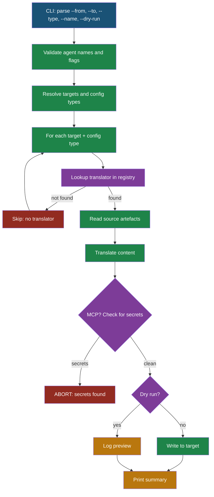

# Cross-Agent Configuration Migration

## Overview

The `agentsync migrate` command translates configuration from one AI agent's format to another. It reads local agent config files, transforms them through format-specific translators, and writes the result to the target agent's config location.

No vault initialisation is required — `migrate` operates on local files only.

## Command

```bash
agentsync migrate --from <agent> --to <agent|all> [--type <type>] [--name <file>] [--dry-run]
```

| Flag | Required | Values | Description |
|------|----------|--------|-------------|
| `--from` | yes | claude, cursor, codex, copilot, vscode | Source agent |
| `--to` | yes | claude, cursor, codex, copilot, vscode, all | Target agent(s) |
| `--type` | no | global-rules, mcp, commands | Filter to one config type |
| `--name` | no | filename (requires --type) | Migrate a single artefact |
| `--dry-run` | no | — | Preview without writing |

## Config Type Support Matrix

| From \ To | Claude | Cursor | Codex | Copilot | VS Code |
|-----------|--------|--------|-------|---------|---------|
| **Claude** | — | GR, MCP, CMD | GR, MCP, CMD | GR, CMD | MCP |
| **Cursor** | GR, MCP, CMD | — | GR, MCP, CMD | GR, CMD | MCP |
| **Codex** | GR, MCP, CMD | GR, MCP, CMD | — | GR, CMD | MCP |
| **Copilot** | GR, CMD | GR, CMD | GR, CMD | — | — |
| **VS Code** | MCP | MCP | MCP | — | — |

**GR** = global-rules, **MCP** = MCP servers, **CMD** = commands

## Migration Flow



## Key Behaviours

- **Overwrite on collision**: If the target already has a matching entry, the source value wins.
- **MCP per-server merge**: Only colliding server names are overwritten; target-only servers are preserved.
- **Secret detection**: If API keys or tokens are found in MCP `env` fields, migration aborts with a clear error. Remove literal secrets and retry.
- **Graceful skipping**: Missing source files and unsupported pairs produce skip messages, not errors.

## Examples

### Migrate everything from Claude to Cursor

```bash
agentsync migrate --from claude --to cursor --dry-run   # preview
agentsync migrate --from claude --to cursor              # apply
```

### Migrate only MCP servers to Codex (JSON → TOML)

```bash
agentsync migrate --from claude --to codex --type mcp
```

### Broadcast to all agents

```bash
agentsync migrate --from claude --to all
```

### Migrate a single command file

```bash
agentsync migrate --from claude --to cursor --type commands --name review.md
```

## Related docs

- [command-reference.md](command-reference.md)
- [architecture.md](architecture.md)
