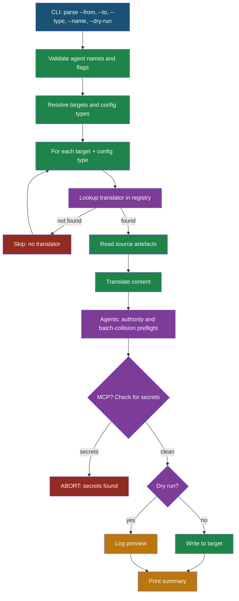

# Cross-Agent Configuration Migration

## Overview

Translate configuration from one AI agent's format to another. The migrator reads local agent config files, transforms them through format-specific translators, and writes the result to the target agent's config location. OpenCode is available here as a migration endpoint only; it is not a vault adapter.

No vault initialisation is required — migration operates on local files only.

> **Not the vault-format migration.** `agentsync migrate` translates config
> between *agents* (Claude → Cursor, etc.). Upgrading an older vault to the
> current per-machine *format* is a separate command, [`agentsync vault
> upgrade`](commands.md#vault). The two never overlap.

## Two ways to run a migration

- **Interactive (TUI)**: run `agentsync`, press `4` for the Migrate tab,
  pick From / To / Type, press Shift-P to preview, then Shift-A to apply.
  Apply is disabled until a preview that matches the current form has been
  rendered, so an accidental keystroke cannot trigger an unreviewed write.
- **Scripted (CLI)**: use the flags below from a shell or CI. The TUI
  calls the same planner internally, so the dry-run output is identical.

## Command

```bash
agentsync migrate --from <agent> --to <agent|all> [--type <type>] [--name <file>] [--dry-run]
```

| Flag | Required | Values | Description |
|------|----------|--------|-------------|
| `--from` | yes | claude, cursor, codex, copilot, vscode, opencode | Source agent |
| `--to` | yes | claude, cursor, codex, copilot, vscode, opencode, all | Target agent(s) |
| `--type` | no | global-rules, mcp, commands, skills, rules, agents | Filter to one config type |
| `--name` | no | artefact name (requires --type) | Migrate one exact artefact. Recursive Claude agents and OpenCode commands/agents use the source-relative filename, such as `teams/reviewer.md`. Hard-errors if not found. |
| `--dry-run` | no | — | Preview without writing |

## Config Type Support Matrix

| From \ To | Claude | Cursor | Codex | Copilot | VS Code | OpenCode |
|-----------|--------|--------|-------|---------|---------|----------|
| **Claude** | — | GR, MCP, CMD, SK, RU, AG | GR, MCP, CMD†, SK, RU, AG | GR, MCP, CMD, SK, AG | MCP, AG | GR, MCP, CMD, SK§, AG |
| **Cursor** | GR, MCP, CMD, SK, RU, AG | — | GR, MCP, CMD†, SK, RU, AG | GR, MCP, CMD, SK, AG | MCP, AG | GR, MCP, CMD, SK, AG |
| **Codex** | GR, MCP, SK, RU, AG | GR, MCP, SK, RU, AG | — | GR, MCP, SK, AG | MCP, AG | GR, MCP, SK§, AG |
| **Copilot** | GR, MCP, CMD, SK, AG | GR, MCP, CMD, SK, AG | GR, MCP, CMD†, SK, AG | — | MCP‡ | GR, MCP, CMD, SK, AG |
| **VS Code** | MCP, AG | MCP, AG | MCP, AG | MCP‡ | — | MCP, AG |
| **OpenCode** | GR, MCP, CMD, SK, AG | GR, MCP, CMD, SK, AG | GR, MCP, CMD†, SK, AG | GR, MCP, CMD, SK, AG | MCP, AG | — |

**GR** = global-rules · **MCP** = MCP servers · **CMD** = commands · **SK** = skills · **RU** = rules folder · **AG** = custom agents

**†** Codex has no native slash-commands surface, so `commands → codex` wraps each command as a Codex skill at `~/.agents/skills/<name>/SKILL.md` with a synthesised `name`/`description` frontmatter. Codex skills are user-invokable as `/<name>`, so the wrapped form actually executes — unlike previous versions which wrote into `~/.codex/rules/`, where Codex never loaded the file.

**‡** Copilot CLI and VS Code use one physical custom-agent store. Direct `agents` migration between those two logical names is rejected before writes; their separate MCP endpoints remain migratable. Without `--type`, supported non-agent categories are written, agents are skipped with an error, and the command exits 1. Use `--type mcp` for an MCP-only migration that exits successfully.

**§** OpenCode normally discovers Claude's `~/.claude/skills/` and Codex's shared `~/.agents/skills/`, so migration avoids a duplicate native copy. `OPENCODE_DISABLE_EXTERNAL_SKILLS` disables both shared roots. `OPENCODE_DISABLE_CLAUDE_CODE` or `OPENCODE_DISABLE_CLAUDE_CODE_SKILLS` disables the Claude root. When discovery is disabled, AgentSync copies the skill to OpenCode's native root. A legacy Codex skill under `$CODEX_HOME/skills/` is always copied.

### Per-category endpoint paths

| Category | Claude | Cursor | Codex | Copilot CLI | VS Code | OpenCode |
|---|---|---|---|---|---|---|
| **global-rules** | `~/.claude/CLAUDE.md` | inline `cursor.general.rules` in settings.json | `$CODEX_HOME/AGENTS.md` | `~/.copilot/copilot-instructions.md` | — | `<config>/AGENTS.md` |
| **mcp** | `~/.claude.json` `mcpServers{}` | `~/.cursor/mcp.json` `mcpServers{}` | `$CODEX_HOME/config.toml` `[mcp_servers.<id>]` | `~/.copilot/mcp-config.json` `mcpServers{}` | `<user>/mcp.json` `servers{}` | effective global sources; writes selected `opencode.json[c]` `mcp{}` |
| **commands** | `~/.claude/commands/*.md` | `~/.cursor/commands/*.md` | `~/.agents/skills/<n>/SKILL.md` (wrapped) | `~/.copilot/prompts/*.prompt.md` | — | `<config>/{command,commands}/**/*.md`; writes `commands/` |
| **skills** | `~/.claude/skills/<n>/SKILL.md` | `~/.cursor/skills/<n>/SKILL.md` | `~/.agents/skills/<n>/SKILL.md` (preferred) or `~/.codex/skills/<n>/` (legacy fallback) | `~/.copilot/skills/<n>/SKILL.md` (best-effort: no documented loader yet) | — | `<config>/{skill,skills}/**/SKILL.md`; writes `skills/` |
| **rules** | `~/.claude/rules/*.md` | `~/.cursor/rules/*.{md,mdc}` | `~/.codex/rules/*.md` | — | — | — |
| **agents** | `~/.claude/agents/**/*.md` | `~/.cursor/agents/*.md` | `$CODEX_HOME/agents/*.toml` | `~/.copilot/agents/*.agent.md` | shared `~/.copilot/agents/*.agent.md` | `<config>/{agent,agents}/**/*.md`; writes `agents/` |

### Why some cells are missing

- **Copilot CLI rules and VS Code rules** are workspace-relative (`.github/instructions/*.instructions.md`). agentsync targets global artefacts only.
- **VS Code skills** — no SKILL.md loader exists; VS Code custom agents are handled by the separate `agents` type.
- **VS Code commands** — VS Code's `chat.promptFilesLocations` is user-configurable with no canonical default. agentsync stays out of MCP-only territory for VS Code rather than guess at a path.
- **Cursor `.mdc` Project Rules** under `.cursor/rules/` are workspace-only and not migrated. The `~/.cursor/rules/` dir IS migrated as a global counterpart.
- **OpenCode rules directories** are not migrated. Global `AGENTS.md` is the supported rules surface; project-level rules are outside this global-only command.

## OpenCode config roots and exclusions

OpenCode's default global config directory is `$XDG_CONFIG_HOME/opencode`, falling back to `~/.config/opencode`. AgentSync reads global config from lowest to highest precedence:

1. default `config.json`
2. default `opencode.json`
3. default `opencode.jsonc`
4. `OPENCODE_CONFIG_DIR/opencode.json`
5. `OPENCODE_CONFIG_DIR/opencode.jsonc`

JSON configuration and command, agent, and skill directory discovery are additive: when `OPENCODE_CONFIG_DIR` is set, AgentSync reads both the default and custom directories. Global `AGENTS.md` is different. It comes only from `OPENCODE_CONFIG_DIR` when set, otherwise from the default directory. Writes use that same active directory for `AGENTS.md`, commands, skills, agents, and MCP. Each config file's MCP entries are validated before layers merge, matching OpenCode's per-file loading contract. MCP writes select only that active directory's existing `opencode.jsonc`, then `opencode.json`, or create `opencode.json`. AgentSync patches incoming servers into that one document. It does not copy lower-precedence effective servers into it. Target-only servers, comments outside replaced server values, and unrelated keys remain intact. A colliding server value in the selected document is replaced as a unit. If the same incoming server name exists in a lower-precedence document, migration stops and asks you to consolidate the layered definition first. This prevents OpenCode's recursive merge from attaching lower-layer credentials or transport fields to the incoming server.

Any non-empty `OPENCODE_CONFIG` or `OPENCODE_CONFIG_CONTENT` value is rejected with an actionable error. AgentSync cannot safely choose a global write target while either external-file or inline configuration is active. These variables and `OPENCODE_CONFIG_DIR` are interpreted literally, including whitespace, to match OpenCode's environment handling.

OpenCode Boolean flags use the runtime's case-sensitive values: `true`, `yes`, `on`, `1`, and `y`; or `false`, `no`, `off`, `0`, and `n`. Unset flags default to false. AgentSync rejects any other configured value before migration.

OpenCode writes preflight that each path remains under the active config root, reject existing symbolic-link or non-directory path components and symbolic-link or non-file targets, then flush an exclusive sibling temporary file before rename. Existing file modes are preserved. Command, agent, and selected skill batches preflight all target paths and normalized identities before the first write. Skill packages still apply sequentially. These batches are not filesystem transactions and directory traversal is not claimed to be race-free.

The OpenCode endpoint deliberately excludes vault backup and restore, TUI configuration, plugins, tools, themes, modes, project/account/remote configuration, auth/runtime/data/cache files, network fetching of remote configuration or referenced content, and a dedicated rules directory. See the official OpenCode documentation for [config precedence](https://opencode.ai/docs/config/), [rules](https://opencode.ai/docs/rules/), [commands](https://opencode.ai/docs/commands/), [skills](https://opencode.ai/docs/skills/), [agents](https://opencode.ai/docs/agents/), and [MCP servers](https://opencode.ai/docs/mcp-servers/).

## Migration Flow

<div class="agentsync-darknodes" markdown>


```mermaid
flowchart TD
    classDef input fill:#1a5276,color:#ffffff
    classDef process fill:#1e8449,color:#ffffff
    classDef decision fill:#7d3c98,color:#ffffff
    classDef output fill:#b9770e,color:#ffffff
    classDef skip fill:#922b21,color:#ffffff

    CLI["CLI: parse --from, --to, --type, --name, --dry-run"]:::input
    VALIDATE["Validate agent names and flags"]:::process
    RESOLVE["Resolve targets and config types"]:::process
    LOOP["For each target + config type"]:::process
    LOOKUP["Lookup translator in registry"]:::decision
    NO_TRANSLATOR["Skip: no translator"]:::skip
    READ["Read source artefacts"]:::process
    TRANSLATE["Translate content"]:::process
    PREFLIGHT["Agents: authority and batch-collision preflight"]:::decision
    DETECT{"MCP? Check for secrets"}:::decision
    ABORT["ABORT: secrets found"]:::skip
    DRYRUN{"Dry run?"}:::decision
    PREVIEW["Log preview"]:::output
    WRITE["Write to target"]:::process
    REPORT["Print summary"]:::output

    CLI --> VALIDATE --> RESOLVE --> LOOP
    LOOP --> LOOKUP
    LOOKUP -->|"not found"| NO_TRANSLATOR
    LOOKUP -->|"found"| READ --> TRANSLATE --> PREFLIGHT --> DETECT
    DETECT -->|"secrets"| ABORT
    DETECT -->|"clean"| DRYRUN
    DRYRUN -->|"yes"| PREVIEW
    DRYRUN -->|"no"| WRITE
    WRITE --> REPORT
    PREVIEW --> REPORT
    NO_TRANSLATOR --> LOOP
```

</div>

## Key Behaviours

- **Overwrite on collision**: If the target already has a matching entry, the source value wins.
- **MCP per-server merge**: Only colliding server names are overwritten; target-only servers are preserved. Each colliding server value is replaced as a unit so fields from an old transport cannot survive. The merge key is target-specific: VS Code uses top-level `servers` + `inputs`, Claude/Cursor/Copilot CLI use `mcpServers`, Codex uses `[mcp_servers.*]`, and OpenCode patches `mcp` in only the selected highest-precedence target document. OpenCode rejects an incoming name that also exists in a lower-precedence document, or a referenced lower-layer server name that AgentSync cannot resolve, because the runtime would recursively merge those definitions.
- **Secret detection**: A case-insensitive `Authorization` header containing literal credential material or a literal OAuth `clientSecret` aborts migration without echoing the value. AgentSync never resolves or reads OpenCode `{env:...}` and `{file:...}` references. Exact environment-backed headers use target-native reference fields where verified; file references and composite values fail closed when the target cannot preserve them. The final serialized MCP bytes also pass through the existing token scanner.
- **Graceful skipping**: Missing source files and unsupported pairs produce skip messages, not errors.
- **`--name` is strict**: When `--name` is set and zero source artefacts match that exact identity, migration hard-errors. Recursive Claude agents and OpenCode commands/agents use a source-relative filename such as `teams/reviewer.md`.
- **Global-rules imports fail closed**: For `--type global-rules`, active Claude `@path` imports fail closed when migrating to OpenCode, which does not expand them. The reverse route applies the same guard because Claude would activate a reference that was inert in OpenCode. Imports inside Markdown code spans or fenced code blocks remain literal.

## Custom agents migration

`agentsync migrate --type agents` translates user-level custom agents across five physical formats:

- Claude recursively reads `~/.claude/agents/**/*.md`; `--name` is the exact source-relative filename, such as `teams/reviewer.md`. Claude requires YAML `name` and `description`, with the prompt in the Markdown body. [Claude Code custom subagents](https://code.claude.com/docs/en/sub-agents)
- Cursor reads direct `~/.cursor/agents/*.md` children. YAML `name` is optional and otherwise derives from the filename; `description`, `model`, `readonly`, and `is_background` follow Cursor's documented format. [Cursor subagents](https://cursor.com/docs/subagents)
- Codex reads direct `$CODEX_HOME/agents/*.toml` children. `name`, `description`, and `developer_instructions` are required; `CODEX_HOME` defaults to `~/.codex`. [Codex custom agents](https://learn.chatgpt.com/docs/agent-configuration/subagents) and [environment variables](https://learn.chatgpt.com/docs/config-file/environment-variables)
- Copilot CLI and VS Code read direct `~/.copilot/agents/*.agent.md` children as one physical format. `target: github-copilot` and `target: vscode` select a logical consumer; an omitted `target` selects both. The Markdown prompt is limited to 30,000 characters. [GitHub custom-agent configuration](https://docs.github.com/en/copilot/reference/custom-agents-configuration) and [VS Code custom agents](https://code.visualstudio.com/docs/agent-customization/custom-agents)
- OpenCode recursively reads both `<config>/agent/**/*.md` and `<config>/agents/**/*.md`. The source-relative filename stem is the identity, so `agents/teams/reviewer.md` is `teams/reviewer`; `--name` uses the exact source-relative filename. `description` is required and `mode` must be `subagent`. OpenCode targets are written under the active config directory's `agents/` root. Restrictive `permission`, `tools`, or `disable` values and the `steps`/`maxSteps` execution bound fail closed when another format cannot preserve their authority. A positive Claude `maxTurns` maps to OpenCode `steps`; malformed caps are rejected. [OpenCode agents](https://opencode.ai/docs/agents/)

Agent discovery skips hidden, symbolic-link, and non-file entries. A missing source root is treated as no agents; unsafe or non-directory roots and directory/file read failures abort before writes. Target preflight rejects a symlinked agent root, symlinked or non-file destinations, Windows-reserved characters and device names, and trailing dots or spaces. These are AgentSync filesystem policies, separate from vendor identity rules. AgentSync does not impose a shared filename-length rule.

Agent translation is fail-closed for authority. Claude-to-shared tool translation emits a GitHub capability alias only when the exact documented Claude tools cover that whole capability group; partial groups are rejected to avoid widening access. Shared aliases are case-insensitive and expand to the full applicable Claude group; shared `*` and omitted Claude tools both mean all tools, while an empty list remains empty. Cursor `readonly: true` maps to Codex `sandbox_mode = "read-only"`. An omitted or read-only Codex sandbox becomes Cursor `readonly: true`; Codex-to-Claude or shared translation rejects the inherited sandbox because those targets have no verified equivalent. Shared invocation controls (`disable-model-invocation`, `user-invocable`, `infer`) are type-checked; restrictive values and the VS Code `agents` subagent control are rejected. Explicit nonrestrictive invocation values are dropped with named warnings. Unknown fields, unknown tool names, and unmappable tool, sandbox, permission, hook, MCP, skill, memory, or isolation controls produce a per-file error and no target write. Known non-authority loss, such as an incompatible `model`, produces a warning naming the field.

For shared sources, the `.agent.md` filename stem is the programmatic identity; optional `name` is display metadata and warns when translation drops a different value. Each physical target is planned before writes. Duplicate logical identities and Unicode-normalized or case-equivalent target paths abort that target batch, so a collision cannot leave a partial target set. An existing shared destination is overwritten only when its `target` coverage exactly matches the incoming logical coverage; malformed, opposite, narrower, or broader ownership is rejected. Other `--to all` physical targets may still proceed. Agent writes stage and flush a same-directory exclusive temporary file before rename, but the batch is not a multi-file transaction and directory traversal is not claimed race-free. `--dry-run` performs the same translation and preflight without writing. `--to all` writes one shared Copilot/VS Code file with no `target`; direct logical targets write an explicit `target` value.

## Skills migration

`agentsync migrate --type skills --from <agent> --to <agent|all>` cross-translates SKILL.md packages between Claude, Cursor, Codex, and OpenCode. OpenCode recursively reads both singular and plural native roots. OpenCode source and target skills require `name` and `description`; `name` must use 1–64 lowercase alphanumeric characters separated by single hyphens and match the containing directory, while `description` is limited to 1–1024 characters. Valid targets copy to the active config directory's `skills/` root. Copilot CLI is supported as a best-effort target — files land in `~/.copilot/skills/<name>/` but Copilot does not yet implement a documented SKILL.md loader, so a warning is emitted. VS Code is skipped (no SKILL.md surface).

Each skill directory's supporting files (`reference.md`, `scripts/*`, assets) ride along as sidecars — they're written under the destination skill dir verbatim. Binary assets are base64-roundtripped. Skill names are validated against the same traversal/hidden-name guard the snapshot path uses. A nested directory with its own `SKILL.md` is migrated as an independent skill and is not copied into its parent package as a sidecar.

Skills targeting OpenCode fail closed when source frontmatter contains vendor authority controls that OpenCode's skill loader would ignore, including tool restrictions, invocation controls, hooks, execution context, or shell/path controls. The same fields in an OpenCode source fail closed before they can become active permissions in another vendor's loader. Claude skill shell interpolation also fails closed for OpenCode because OpenCode loads the body literally. In the reverse direction, OpenCode skill bodies containing active Claude shell or `@path` syntax fail closed for a Claude target because Claude would execute text that OpenCode leaves inert. Inline shell interpolation is active only at line start or after whitespace. Genuine inline code spans remain literal, but Claude still scans ordinary fenced contents and recognizes multiline shell blocks anywhere in the body, so active shell syntax there fails closed. This validation also runs when OpenCode discovers a shared Claude or Codex skill without copying it.

For Codex sources, the migrate command prefers `~/.agents/skills/` (the current spec, cites [agentskills.io](https://agentskills.io)) and falls back to the legacy `~/.codex/skills/` only when the former is missing. OpenCode normally discovers the shared Claude and Codex roots, so AgentSync reports a warning and avoids a native duplicate. `OPENCODE_DISABLE_EXTERNAL_SKILLS` disables both shared roots; `OPENCODE_DISABLE_CLAUDE_CODE` and `OPENCODE_DISABLE_CLAUDE_CODE_SKILLS` independently disable Claude discovery. A disabled shared root is copied into native OpenCode storage. The legacy Codex root is not shared and is always copied.

Hidden, symbolic-link, and non-file skill entries are skipped. Unsafe or non-directory OpenCode source roots, invalid native skill metadata, unsafe targets, and target preflight failures abort the affected migration. Every selected target's `SKILL.md` and sidecars are containment-checked before the first package write and written through a staged same-directory rename. If a skill is symlinked from a shared repo, copy it into the source root as a real directory before migrating.

## Rules migration

`agentsync migrate --type rules --from <agent> --to <agent|all>` cross-translates the global rules folder between Claude (`~/.claude/rules/`), Cursor (`~/.cursor/rules/`), and Codex (`~/.codex/rules/`). Copilot CLI and VS Code rules live workspace-relative under `.github/instructions/` and are intentionally excluded.

Cursor's `.mdc` frontmatter (`description`, `globs`, `alwaysApply`) is **stripped on egress** to claude/codex with a warning naming the dropped fields, and the filename is rewritten `.mdc → .md`. The reverse direction (claude/codex → cursor) writes plain `.md` (no frontmatter synthesis — the source has no scoping information to translate).

## Commands → Codex (skill wrapping)

OpenCode command discovery recursively reads both `<config>/command/**/*.md` and `<config>/commands/**/*.md`; `--name` is the exact source-relative filename. Hidden, symbolic-link, and non-file entries are skipped, while unsafe roots and read failures abort. When an OpenCode command targets another format, `agent`, `subtask`, and inert vendor-authority frontmatter fail closed because the target could change their meaning. OpenCode-to-Cursor, Codex, and Copilot command bodies containing active `` !`command` `` or `@file` syntax also fail closed because those targets have no verified equivalent. OpenCode-to-Claude accepts compatible standalone substitutions and file references, but rejects multiline shell blocks anywhere in the body and shell substitutions attached directly to other text because Claude parses them differently. Commands targeting OpenCode fail closed when source frontmatter contains authority controls, including `agent` and `subtask`, that OpenCode would activate without a verified source equivalent. Cursor and Copilot command bodies containing OpenCode's `!` shell or `@file` interpolation syntax are rejected because those sources define plain Markdown rather than executable interpolation. Claude inline shell interpolation migrates only where Claude and OpenCode use the same whitespace boundary; Claude multiline shell blocks and inline forms that OpenCode would newly activate fail closed. AgentSync resolves every final command path before writing; existing symbolic-link components, unsafe paths, and incoming or existing NFC/case-fold identity collisions abort that target's entire command batch.

Codex has no native slash-commands surface. Earlier agentsync versions wrote `~/.codex/rules/*.md` as a degraded target, but Codex never actually loaded those files as commands. This release wraps each command as a Codex skill instead:

- `~/.claude/commands/lint.md` → `~/.agents/skills/lint/SKILL.md`
- Frontmatter synthesis: `name: <basename>`, `description: <from source frontmatter, or first body paragraph, or "Migrated from <source> command">`
- Compatible source frontmatter (`allowed-tools`, `argument-hint`, `model`) passes through.
- Body is preserved verbatim.

After migration, the command is invokable in Codex as `/<basename>`. A warning is emitted to make the transformation visible. Existing `~/.codex/rules/*.md` files written by previous agentsync versions are not removed by this command — clean them manually if you want to avoid duplicate intent.

An unfiltered OpenCode → Codex migration preflights commands and native skills together because both write under `~/.agents/skills/`. A normalized command/skill destination collision aborts both batches before either writes.

## MCP Transport Support

AgentSync parses each source MCP config into a transport-aware intermediate
model before writing the target. The model represents a discriminated union
over `stdio`, `http`, and `sse` transports, common `cwd`, `enabled`, and
`timeout` fields, plus VS Code top-level `inputs` and `sandbox` and per-server
`sandboxEnabled`, `dev`, and `envFile` metadata.

| Target | Schema | Supported transports | Lossy fields |
|--------|--------|----------------------|--------------|
| **VS Code** | top-level `servers` + `inputs` ([docs](https://code.visualstudio.com/docs/agents/reference/mcp-configuration)) | stdio, http, sse | `enabled: false`, OpenCode `oauth: false`, Codex stdio or non-local execution contexts, and unmapped Codex tool/OAuth authority fail closed; `enabled: true`, timeout, and compatible non-authority losses are named |
| **Claude** | top-level `mcpServers` (stdio-only) | stdio | disabled stdio servers fail closed; non-stdio servers are dropped with warning; `inputs` and stdio-only `envFile`/`sandbox`/`sandboxEnabled`/`dev` are named losses |
| **Cursor** | top-level `mcpServers` (stdio-only) | stdio | same as Claude |
| **Codex** | TOML `[mcp_servers.<name>]` | stdio or URL transport, inferred from `command` or `url` | `inputs`, SSE distinction, unsupported non-authority OAuth fields, and unsupported metadata are named losses; VS Code sandboxing and enterprise-managed OAuth fail closed |
| **OpenCode** | top-level `mcp` ([docs](https://opencode.ai/docs/mcp-servers/)) | `local`, `remote` | `inputs`, compatible VS Code-only metadata, and an SSE-vs-HTTP distinction are named losses; enterprise-managed OAuth, unsupported VS Code variables, and Copilot stdio environment isolation fail closed |

OpenCode local servers preserve the command array, working directory, environment, enabled state, and timeout. Empty command arguments are preserved; the executable itself must be non-empty. VS Code MCP input accepts JSONC comments and trailing commas. VS Code numeric environment values convert to their equivalent strings; `null` fails closed because OpenCode has no removal-value equivalent. Remote servers preserve the URL, headers, enabled state, timeout, and OAuth configuration, including literal `oauth: false`. A disabled OpenCode server fails closed for VS Code; a disabled local server also fails closed for stdio-only targets because dropping the flag would activate it. Codex preserves the flag. Other unrepresentable fields and transports produce named warnings. A VS Code top-level sandbox policy is always named when a target cannot preserve it.

Codex stdio entries map `command`, `args`, `env`, `cwd`, `enabled`, and `tool_timeout_sec`. Remote entries map `url`, `http_headers`, `env_http_headers`, `bearer_token_env_var`, `oauth.client_id`, `scopes`, `enabled`, and `tool_timeout_sec`. Codex environment-backed headers become OpenCode `{env:...}` references. AgentSync warns because missing or empty variables have different runtime behaviour: Codex omits a missing environment header and rejects a missing bearer variable, while OpenCode substitutes an empty string. Codex-to-OpenCode stdio migration fails closed because Codex restricts the child environment while OpenCode inherits the full host environment. An omitted or explicit local Codex `environment_id` is representable; a non-local ID fails closed because OpenCode has no executor boundary. Codex MCP tool allowlists, denylists, approval modes, `omit_tools_from`, `oauth_resource`, and ChatGPT authentication also fail closed for OpenCode because it has no verified equivalents. An explicit empty Codex OAuth scope list fails closed because OpenCode would treat an omitted scope as eligible for discovery. OpenCode request timeout milliseconds convert to Codex seconds only when the conversion is exact. AgentSync does not invent Codex `type`, `headers`, `auth`, or generic `timeout` keys.

Codex-to-VS Code migration also fails closed for stdio servers because VS Code inherits the host environment, for non-local `environment_id` values, and for tool filters, approval controls, `omit_tools_from`, ChatGPT authentication, OAuth scopes, or `oauth_resource`. A VS Code server with `sandboxEnabled: true` fails closed for Codex because Codex has no equivalent filesystem and network sandbox.

Copilot CLI local servers fail closed for OpenCode because Copilot inherits only `PATH` plus configured variables while OpenCode passes the full host environment. Canonical Copilot `type: "local"`, timeout, `type: "streamable-http"`, and unrestricted `tools: ["*"]` are normalized before this check. Missing, malformed, empty, or restricted tool lists fail closed because OpenCode has no per-server tool filter. Static public authorization-code OAuth maps `oauthClientId` to OpenCode `oauth.clientId`; the equivalent Copilot defaults `oauthPublicClient: true`, `oauthGrantType: "authorization_code"`, and `oidc: false` are omitted. Confidential clients, client-credentials grants, and enabled OIDC fail closed. For remote servers, `$VAR` and `${VAR}` header references become OpenCode `{env:VAR}` references. Copilot `${VAR:-default}` headers fail closed because OpenCode has no equivalent default syntax.

In the reverse direction, OpenCode local servers fail closed for Copilot because the full inherited environment cannot be reduced to Copilot's `PATH`-only default without changing behaviour. OpenCode remote servers become canonical Copilot `type: "http"` entries with `tools: ["*"]`; AgentSync warns that OpenCode's HTTP-to-SSE fallback is not preserved. `enabled: false` fails closed because Copilot has no verified disabled equivalent, while explicit `enabled: true` is dropped with a named warning. Header `{env:VAR}` references become Copilot `${VAR}` references, while file references and Copilot variable syntax that was literal in OpenCode fail closed. Public OAuth `clientId` maps to `oauthClientId`; `oauth: false`, client secrets, scopes, callback ports, and redirect URIs fail closed because Copilot's file schema has no equivalent.

For OpenCode-to-Codex migration, an exact `{env:VAR}` header becomes `env_http_headers`, and `Authorization: Bearer {env:VAR}` becomes `bearer_token_env_var`. OpenCode file references, composite reference values, and references in fields without a verified Codex equivalent fail closed without being resolved. OpenCode OAuth `clientId` and whitespace-delimited `scope` map to Codex `oauth.client_id` and `scopes`; `clientSecret`, `callbackPort`, and `redirectUri` are named losses after the secret gate runs.

VS Code OAuth is written under `oauth`, never `auth`. AgentSync maps `clientId`; `enterpriseManaged: true` fails closed for Codex and OpenCode because neither target preserves the enterprise identity-provider boundary, while explicit `false` is a named loss. OpenCode-compatible OAuth fields are preserved when VS Code is the source and the OpenCode target can represent them. OpenCode `oauth: false` fails closed for VS Code because omitting the field would enable automatic OAuth. OpenCode `{env:...}` values become VS Code `${env:...}` variables. In the reverse direction, VS Code `${env:NAME}` values become OpenCode `{env:NAME}` references. Other VS Code variables, variable-bearing object keys, literal OpenCode references in VS Code values, OpenCode file references, and referenced object keys fail closed because the target has no verified equivalent.

Malformed per-server entries abort the MCP translation before any valid sibling can be written. When a target cannot represent a transport, AgentSync emits an **explicit
translator warning** that names the dropped server and the unsupported
transport (e.g. `vscode → claude (mcp): Dropped server "remote": transport
"http" is not representable…`). Warnings flow into `MigrateResult.warnings`
so the CLI surfaces them — they are never dropped silently.

If a source migrates to a stdio-only target where **every** server is
unrepresentable (e.g. an all-HTTP VS Code config → Claude), the translator
skips the write rather than creating a brand-new file containing only
`{"mcpServers":{}}`. The warning still surfaces in `MigrateResult.warnings`
so the operator hears about the dropped servers.

## Examples

### Migrate everything from Claude to Cursor

```bash
agentsync migrate --from claude --to cursor --dry-run   # preview
agentsync migrate --from claude --to cursor              # apply
```

### Migrate only MCP servers to Codex (JSON → TOML)

```bash
agentsync migrate --from claude --to codex --type mcp
```

### Broadcast to all agents

```bash
agentsync migrate --from claude --to all
```

### Migrate a single command file

```bash
agentsync migrate --from claude --to cursor --type commands --name review.md
```

### Migrate a single skill (with its supporting files)

```bash
agentsync migrate --from claude --to codex --type skills --name code-reviewer
```

### Migrate the rules folder Cursor → Claude (strips .mdc frontmatter)

```bash
agentsync migrate --from cursor --to claude --type rules
```

### Set up Copilot CLI MCP from your Claude config

```bash
agentsync migrate --from claude --to copilot --type mcp
```

### Preview an OpenCode migration

```bash
agentsync migrate --from opencode --to claude --dry-run
```

### Write Claude configuration to OpenCode

```bash
agentsync migrate --from claude --to opencode
```

### Wrap Claude commands as Codex skills

```bash
agentsync migrate --from claude --to codex --type commands
# writes ~/.agents/skills/<name>/SKILL.md per command
```

## Related docs

- [Commands](commands.md)
- [Architecture](architecture.md)
