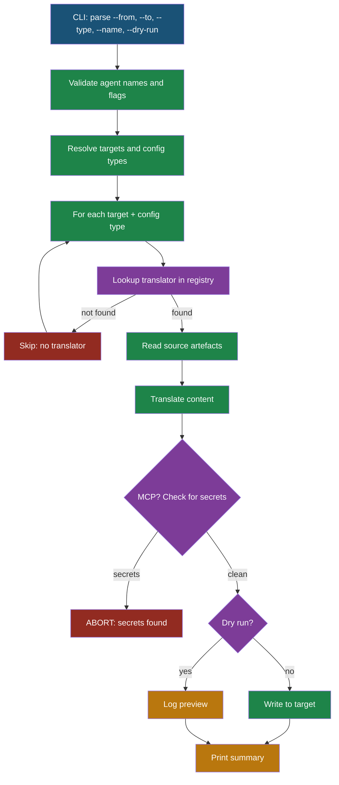

# Cross-Agent Configuration Migration

## Overview

The `agentsync migrate` command translates configuration from one AI agent's format to another. It reads local agent config files, transforms them through format-specific translators, and writes the result to the target agent's config location.

No vault initialisation is required — `migrate` operates on local files only.

## Command

```bash
agentsync migrate --from <agent> --to <agent|all> [--type <type>] [--name <file>] [--dry-run]
```

| Flag | Required | Values | Description |
|------|----------|--------|-------------|
| `--from` | yes | claude, cursor, codex, copilot, vscode | Source agent |
| `--to` | yes | claude, cursor, codex, copilot, vscode, all | Target agent(s) |
| `--type` | no | global-rules, mcp, commands, skills, rules | Filter to one config type |
| `--name` | no | artefact name (requires --type) | Migrate a single artefact (file or skill/rules dir name). Hard-errors if not found. |
| `--dry-run` | no | — | Preview without writing |

## Config Type Support Matrix

| From \ To | Claude | Cursor | Codex | Copilot | VS Code |
|-----------|--------|--------|-------|---------|---------|
| **Claude** | — | GR, MCP, CMD, SK, RU | GR, MCP, CMD†, SK, RU | GR, MCP, CMD, SK | MCP |
| **Cursor** | GR, MCP, CMD, SK, RU | — | GR, MCP, CMD†, SK, RU | GR, MCP, CMD, SK | MCP |
| **Codex** | GR, MCP, SK, RU | GR, MCP, SK, RU | — | GR, MCP, SK | MCP |
| **Copilot** | GR, MCP, CMD, SK | GR, MCP, CMD, SK | GR, MCP, CMD†, SK | — | MCP |
| **VS Code** | MCP | MCP | MCP | MCP | — |

**GR** = global-rules · **MCP** = MCP servers · **CMD** = commands · **SK** = skills · **RU** = rules folder

**†** Codex has no native slash-commands surface, so `commands → codex` wraps each command as a Codex skill at `~/.agents/skills/<name>/SKILL.md` with a synthesised `name`/`description` frontmatter. Codex skills are user-invokable as `/<name>`, so the wrapped form actually executes — unlike previous versions which wrote into `~/.codex/rules/`, where Codex never loaded the file.

### Per-category endpoint paths

| Category | Claude | Cursor | Codex | Copilot CLI | VS Code |
|---|---|---|---|---|---|
| **global-rules** | `~/.claude/CLAUDE.md` | inline `cursor.general.rules` in settings.json | `$CODEX_HOME/AGENTS.md` | `~/.copilot/copilot-instructions.md` | — |
| **mcp** | `~/.claude.json` `mcpServers{}` | `~/.cursor/mcp.json` `mcpServers{}` | `$CODEX_HOME/config.toml` `[mcp_servers.<id>]` | `~/.copilot/mcp-config.json` `mcpServers{}` | `<user>/mcp.json` `servers{}` |
| **commands** | `~/.claude/commands/*.md` | `~/.cursor/commands/*.md` | `~/.agents/skills/<n>/SKILL.md` (wrapped) | `~/.copilot/prompts/*.prompt.md` | — |
| **skills** | `~/.claude/skills/<n>/SKILL.md` | `~/.cursor/skills/<n>/SKILL.md` | `~/.agents/skills/<n>/SKILL.md` (preferred) or `~/.codex/skills/<n>/` (legacy fallback) | `~/.copilot/skills/<n>/SKILL.md` (best-effort: no documented loader yet) | — |
| **rules** | `~/.claude/rules/*.md` | `~/.cursor/rules/*.{md,mdc}` | `~/.codex/rules/*.md` | — | — |

### Why some cells are missing

- **Copilot CLI rules and VS Code rules** are workspace-relative (`.github/instructions/*.instructions.md`). agentsync targets global artefacts only.
- **VS Code skills** — no SKILL.md loader exists; VS Code's custom-agents (`.agent.md`) are a different concept.
- **VS Code commands** — VS Code's `chat.promptFilesLocations` is user-configurable with no canonical default. agentsync stays out of MCP-only territory for VS Code rather than guess at a path.
- **Cursor `.mdc` Project Rules** under `.cursor/rules/` are workspace-only and not migrated. The `~/.cursor/rules/` dir IS migrated as a global counterpart.

## Migration Flow

<div class="agentsync-darknodes" markdown>


```mermaid
flowchart TD
    classDef input fill:#1a5276,color:#ffffff
    classDef process fill:#1e8449,color:#ffffff
    classDef decision fill:#7d3c98,color:#ffffff
    classDef output fill:#b9770e,color:#ffffff
    classDef skip fill:#922b21,color:#ffffff

    CLI["CLI: parse --from, --to, --type, --name, --dry-run"]:::input
    VALIDATE["Validate agent names and flags"]:::process
    RESOLVE["Resolve targets and config types"]:::process
    LOOP["For each target + config type"]:::process
    LOOKUP["Lookup translator in registry"]:::decision
    NO_TRANSLATOR["Skip: no translator"]:::skip
    READ["Read source artefacts"]:::process
    TRANSLATE["Translate content"]:::process
    DETECT{"MCP? Check for secrets"}:::decision
    ABORT["ABORT: secrets found"]:::skip
    DRYRUN{"Dry run?"}:::decision
    PREVIEW["Log preview"]:::output
    WRITE["Write to target"]:::process
    REPORT["Print summary"]:::output

    CLI --> VALIDATE --> RESOLVE --> LOOP
    LOOP --> LOOKUP
    LOOKUP -->|"not found"| NO_TRANSLATOR
    LOOKUP -->|"found"| READ --> TRANSLATE --> DETECT
    DETECT -->|"secrets"| ABORT
    DETECT -->|"clean"| DRYRUN
    DRYRUN -->|"yes"| PREVIEW
    DRYRUN -->|"no"| WRITE
    WRITE --> REPORT
    PREVIEW --> REPORT
    NO_TRANSLATOR --> LOOP
```

</div>

## Key Behaviours

- **Overwrite on collision**: If the target already has a matching entry, the source value wins.
- **MCP per-server merge**: Only colliding server names are overwritten; target-only servers are preserved. The merge key is target-specific: VS Code uses top-level `servers` + `inputs`, Claude/Cursor/Copilot CLI use `mcpServers`, Codex uses `[mcp.servers.*]` TOML tables.
- **Secret detection**: If API keys or tokens are found in MCP content (including HTTP-transport `headers.Authorization`), migration aborts with a clear error. Remove literal secrets and retry.
- **Graceful skipping**: Missing source files and unsupported pairs produce skip messages, not errors.
- **`--name` is strict**: When `--name` is set and zero source artefacts match that name, migration hard-errors and exits non-zero rather than silently skipping. Catches typos. Behaviour change in this version — earlier releases silently skipped.

## Skills migration

`agentsync migrate --type skills --from <agent> --to <agent|all>` cross-translates the Anthropic SKILL.md spec between Claude, Cursor, and Codex (all three implement the same progressive-disclosure spec verbatim). Copilot CLI is supported as a best-effort target — files land in `~/.copilot/skills/<name>/` but Copilot has no documented SKILL.md loader as of 2026-05, so a warning is emitted. VS Code is skipped (no SKILL.md surface).

Each skill directory's supporting files (`reference.md`, `scripts/*`, assets) ride along as sidecars — they're written under the destination skill dir verbatim. Binary assets are base64-roundtripped. Skill names are validated against the same traversal/hidden-name guard the snapshot path uses.

For Codex sources, the migrate command prefers `~/.agents/skills/` (the current spec, cites [agentskills.io](https://agentskills.io)) and falls back to the legacy `~/.codex/skills/` only when the former is missing.

**Symlinked skills are silently skipped** (matches the existing snapshot policy). If you have skills symlinked from a shared repo into `~/.claude/skills/<name>`, those entries won't migrate — copy the target dir into your skills root as a real directory first, or rsync from the source repo.

## Rules migration

`agentsync migrate --type rules --from <agent> --to <agent|all>` cross-translates the global rules folder between Claude (`~/.claude/rules/`), Cursor (`~/.cursor/rules/`), and Codex (`~/.codex/rules/`). Copilot CLI and VS Code rules live workspace-relative under `.github/instructions/` and are intentionally excluded.

Cursor's `.mdc` frontmatter (`description`, `globs`, `alwaysApply`) is **stripped on egress** to claude/codex with a warning naming the dropped fields, and the filename is rewritten `.mdc → .md`. The reverse direction (claude/codex → cursor) writes plain `.md` (no frontmatter synthesis — the source has no scoping information to translate).

## Commands → Codex (skill wrapping)

Codex has no native slash-commands surface. Earlier agentsync versions wrote `~/.codex/rules/*.md` as a degraded target, but Codex never actually loaded those files as commands. This release wraps each command as a Codex skill instead:

- `~/.claude/commands/lint.md` → `~/.agents/skills/lint/SKILL.md`
- Frontmatter synthesis: `name: <basename>`, `description: <from source frontmatter, or first body paragraph, or "Migrated from <source> command">`
- Compatible source frontmatter (`allowed-tools`, `argument-hint`, `model`) passes through.
- Body is preserved verbatim.

After migration, the command is invokable in Codex as `/<basename>`. A warning is emitted to make the transformation visible. Existing `~/.codex/rules/*.md` files written by previous agentsync versions are not removed by this command — clean them manually if you want to avoid duplicate intent.

## MCP Transport Support

AgentSync parses each source MCP config into a transport-aware intermediate
model before writing the target. The model represents a discriminated union
over `stdio`, `http`, and `sse` transports plus VS Code-specific metadata
(`inputs`, `sandbox`, `sandboxEnabled`, `dev`, `envFile`).

| Target | Schema | Supported transports | Lossy fields |
|--------|--------|----------------------|--------------|
| **VS Code** | top-level `servers` + `inputs` ([docs](https://code.visualstudio.com/docs/copilot/reference/mcp-configuration)) | stdio, http, sse | — |
| **Claude** | top-level `mcpServers` (stdio-only) | stdio | non-stdio servers dropped with warning; `inputs` dropped with warning; stdio-only `envFile`/`sandbox`/`sandboxEnabled`/`dev` named per-server in a warning |
| **Cursor** | top-level `mcpServers` (stdio-only) | stdio | same as Claude |
| **Codex** | TOML `[mcp.servers.<name>]` | stdio, plus structured `type`/`url`/`headers`/`auth` for future HTTP/SSE clients | `inputs` dropped with warning |

When a target cannot represent a transport, AgentSync emits an **explicit
translator warning** that names the dropped server and the unsupported
transport (e.g. `vscode → claude (mcp): Dropped server "remote": transport
"http" is not representable…`). Warnings flow into `MigrateResult.warnings`
so the CLI surfaces them — they are never dropped silently.

If a source migrates to a stdio-only target where **every** server is
unrepresentable (e.g. an all-HTTP VS Code config → Claude), the translator
skips the write rather than creating a brand-new file containing only
`{"mcpServers":{}}`. The warning still surfaces in `MigrateResult.warnings`
so the operator hears about the dropped servers.

## Examples

### Migrate everything from Claude to Cursor

```bash
agentsync migrate --from claude --to cursor --dry-run   # preview
agentsync migrate --from claude --to cursor              # apply
```

### Migrate only MCP servers to Codex (JSON → TOML)

```bash
agentsync migrate --from claude --to codex --type mcp
```

### Broadcast to all agents

```bash
agentsync migrate --from claude --to all
```

### Migrate a single command file

```bash
agentsync migrate --from claude --to cursor --type commands --name review.md
```

### Migrate a single skill (with its supporting files)

```bash
agentsync migrate --from claude --to codex --type skills --name code-reviewer
```

### Migrate the rules folder Cursor → Claude (strips .mdc frontmatter)

```bash
agentsync migrate --from cursor --to claude --type rules
```

### Set up Copilot CLI MCP from your Claude config

```bash
agentsync migrate --from claude --to copilot --type mcp
```

### Wrap Claude commands as Codex skills

```bash
agentsync migrate --from claude --to codex --type commands
# writes ~/.agents/skills/<name>/SKILL.md per command
```

## Related docs

- [command-reference.md](command-reference.md)
- [architecture.md](architecture.md)
