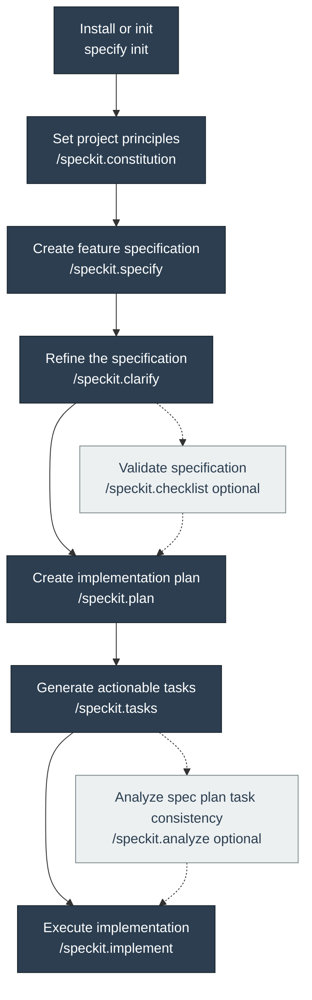

# Speckit Guide

## Purpose

Use this guide when you are defining or continuing feature work in AgentSync through the
spec-kit workflow. It explains what to run, when to run it, which artifacts should appear, and
how to decide the next stage without reading prompt files or shell scripts first.

## Start here

AgentSync already contains a spec-kit installation. For normal feature work in this repository,
do not run `specify init` again.

Start with:

- `/speckit.specify` for most new feature work
- `/speckit.constitution` only when repository principles or governance rules need to change
- [speckit-local-development.md](speckit-local-development.md) when you are maintaining the
  repo-local speckit setup itself

Use `specify init` only when you are bootstrapping a different repository or deliberately
re-initializing a fresh spec-kit installation outside the current AgentSync clone.

## Setup modes

| Mode | Use when | First step | Notes |
| ---- | -------- | ---------- | ----- |
| Existing AgentSync feature work | You are adding or changing a feature in this repo | `/speckit.specify` | This is the default path for daily work here |
| Constitution change | Repo principles, review gates, or governance rules need to change | `/speckit.constitution` | Only use this before feature work when the rules themselves must move |
| Repo-local speckit maintenance | Prompt files, agent files, scripts, or local workflow docs are changing | [speckit-local-development.md](speckit-local-development.md) | Start there before editing `.github/` or `.specify/` |
| New repository bootstrap | You are setting up spec-kit in some other repo | `specify init` | Not part of normal AgentSync contributor flow |

## Official workflow at a glance



This is the official quickstart order. In AgentSync, `specify init` and the constitution are
already present, so most feature work begins at `/speckit.specify`. The diagram still shows the
full upstream flow so you can compare repo-local behavior to the source material directly.

## Standard AgentSync path

1. Confirm whether the current constitution still fits the work. If not, update it first with
   `/speckit.constitution`.
2. Run `/speckit.specify` to create or update the feature specification.
3. Use `/speckit.clarify` when the spec still has open questions or weak acceptance criteria.
4. Use `/speckit.checklist` only when you want an explicit validation pass before planning.
5. Run `/speckit.plan` to produce the implementation plan and supporting design artifacts.
6. Run `/speckit.tasks` to break the plan into executable work.
7. Use `/speckit.analyze` when you want a consistency review across spec, plan, and tasks before
   implementation.
8. Run `/speckit.implement` once the tasks are approved and the feature is ready to execute.

## Command guide

| Command | Use when | Provide | Expected output | Next likely step |
| ------- | -------- | ------- | --------------- | ---------------- |
| `specify init` | Bootstrapping spec-kit in a repo that does not already have it | Installation choice and target repo | `.specify/`, prompt files, agent files, and base workflow assets | `/speckit.constitution` |
| `/speckit.constitution` | Repository principles or governance rules need to change | The principle changes and their impact | Updated `.specify/memory/constitution.md` and any dependent workflow expectations | `/speckit.specify` or re-review of existing plans |
| `/speckit.specify` | Starting a new feature or replacing a weak feature description | The user problem, scope, and expected outcome | A feature branch and `specs/<feature>/spec.md` | `/speckit.clarify` or `/speckit.plan` |
| `/speckit.clarify` | The spec still has gaps, conflicts, or weak scenarios | Answers to focused clarification questions | A tighter `spec.md` with clearer requirements and success criteria | `/speckit.checklist` or `/speckit.plan` |
| `/speckit.checklist` | You want an explicit quality pass before planning | The current feature spec and any special review focus | Checklist guidance or updated checklist state | `/speckit.plan` |
| `/speckit.plan` | The spec is stable enough for implementation design | The approved spec and any repo constraints | `plan.md`, `research.md`, `data-model.md`, `contracts/`, and `quickstart.md` | `/speckit.tasks` |
| `/speckit.tasks` | The plan is ready to become executable work | The plan, spec, contracts, and supporting artifacts | `tasks.md` with ordered, file-scoped tasks | `/speckit.analyze` or `/speckit.implement` |
| `/speckit.analyze` | You want a consistency check before implementation | The current spec, plan, tasks, and constitution | A consistency report with gaps, conflicts, or confirmation | Artifact fixes or `/speckit.implement` |
| `/speckit.implement` | The tasks are approved and you are ready to do the work | The current task plan and repository state | Documentation or code changes plus task progress updates | Validation and review |

## Feature artifact map

| Artifact | Produced by | Answers | Ready when |
| -------- | ----------- | ------- | ---------- |
| `spec.md` | `/speckit.specify` and `/speckit.clarify` | What are we changing, for whom, and how will we know it worked? | User stories, requirements, edge cases, and success criteria are complete |
| `plan.md` | `/speckit.plan` | What technical approach fits this repo and why? | Technical context, phases, constraints, and structure are clear |
| `research.md` | `/speckit.plan` | Which decisions were made and what sources justify them? | Key decisions and authoritative references are recorded |
| `data-model.md` | `/speckit.plan` | Which entities, states, or conceptual surfaces matter? | Core entities and validation rules are explicit |
| `contracts/` | `/speckit.plan` | What interfaces or documentation surfaces must exist? | Surface requirements are concrete enough to implement |
| `quickstart.md` | `/speckit.plan` | How should the implementation be executed and checked? | Validation scenarios and final checks are actionable |
| `tasks.md` | `/speckit.tasks` | What work needs to happen, in what order, and in which files? | Tasks are ordered, file-scoped, and mapped to user stories |

## Readiness signals

| Stage | Ready to move on when | Evidence |
| ----- | --------------------- | -------- |
| Constitution | Principles match the intended change and any governance deltas are explicit | `.specify/memory/constitution.md` |
| Specify | Requirements, user stories, edge cases, and success criteria are concrete | `spec.md` |
| Clarify | No critical open ambiguities remain | `spec.md` and checklist results |
| Plan | Approach, constraints, artifacts, and validation steps are explicit | `plan.md`, `research.md`, `data-model.md`, `contracts/`, `quickstart.md` |
| Tasks | Each story has independent validation and file-scoped work items | `tasks.md` |
| Analyze | No blocking consistency issues remain | Analysis report plus updated artifacts |
| Implement | The right task slice is approved and the repo state is ready for edits | `tasks.md` and current working tree |

## AgentSync example

Use a feature like the one that produced this guide as the mental model.

1. Start the feature:

```text
/speckit.specify Improve documentation to guide speckit development.
```

Expected result:

- a timestamp feature branch such as `20260405-195011-speckit-dev-docs`
- `specs/20260405-195011-speckit-dev-docs/spec.md`

1. Tighten the specification if needed:

```text
/speckit.clarify
```

Expected result:

- stronger scenarios, clearer requirements, and fewer review-time questions

1. Build the implementation design:

```text
/speckit.plan
```

Expected result:

- `plan.md`
- `research.md`
- `data-model.md`
- `contracts/`
- `quickstart.md`

1. Turn the design into work:

```text
/speckit.tasks
```

Expected result:

- `tasks.md` with story-scoped tasks and validation steps

1. Optionally analyze before implementation:

```text
/speckit.analyze
```

1. Implement once the task list is ready:

```text
/speckit.implement
```

## Continue an existing feature

When a feature already exists, work from the branch and artifact state instead of restarting from
scratch.

1. Confirm the active feature paths:

```bash
.specify/scripts/bash/check-prerequisites.sh --paths-only
```

1. Inspect the current artifact set:

- `spec.md` only: run `/speckit.plan`
- `plan.md` exists but `tasks.md` does not: run `/speckit.tasks`
- `tasks.md` exists and you want a review gate: run `/speckit.analyze`
- `tasks.md` exists and the plan is approved: run `/speckit.implement`

1. If the current shell context is not on the right feature branch, switch to the matching branch
   first. For special tooling cases, the scripts also honor `SPECIFY_FEATURE` as an explicit
   override.

## Baseline workflow versus extensions

AgentSync currently has no `.specify/extensions.yml`. That means the baseline workflow above is
the real default path, not a fallback.

Upstream spec-kit supports extensions and presets, but in this repository they should be treated
as advanced layers:

- learn the baseline flow first
- verify any local customization against `.specify/`, `.github/prompts/`, and `.github/agents/`
- update the docs in the same change if extensions, prompts, agents, or workflow rules move

## Related docs

- [speckit-local-development.md](speckit-local-development.md)
- [development.md](development.md)
- [maintenance.md](maintenance.md)
- [troubleshooting.md](troubleshooting.md)
