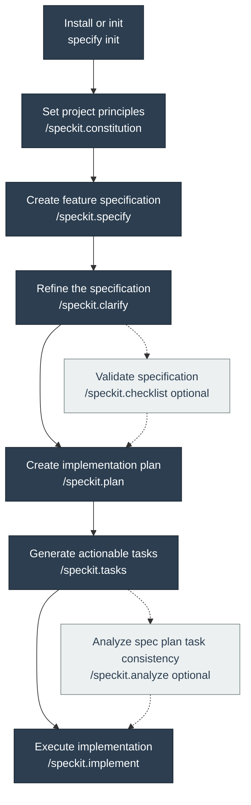

# Implementation Plan: Improve Speckit Development Documentation

**Branch**: `20260405-195011-speckit-dev-docs` | **Date**: 2026-04-05 | **Spec**: [spec.md](./spec.md)
**Input**: Feature specification from `/specs/20260405-195011-speckit-dev-docs/spec.md`

**Note**: This template is filled in by the `/speckit.plan` command. See `.specify/templates/plan-template.md` for the execution workflow.

## Summary

Create a documentation system that teaches contributors how to start using spec-kit in this
repository, when and how to use each workflow command, how the generated artifacts relate to one
another, and how to continue or maintain speckit-driven work locally. The design follows the
official spec-kit installation, quickstart, and local-development guidance while adapting it to
AgentSync's repo-specific conventions: GitHub Copilot prompt files, generated agent definitions,
timestamp-based feature branches, a Mermaid workflow diagram that mirrors the official process,
and a baseline workflow with no configured `.specify/extensions.yml`.

## Technical Context

**Language/Version**: Markdown documentation plus TypeScript 6.0.0 repository context  
**Primary Dependencies**: Existing repo toolchain only; authoritative research sources are official spec-kit documentation and the `github/spec-kit` repository  
**Storage**: Repository-hosted Markdown files under `README.md`, `docs/`, `.github/`, and `.specify/` as referenced documentation sources  
**Testing**: Manual documentation walkthroughs plus repository validation via `bun run check` when final edits are complete  
**Target Platform**: GitHub repository readers and local contributors on macOS, Linux, or Windows using spec-kit with GitHub Copilot in this repository
**Project Type**: Bun-based CLI repository with embedded speckit workflow documentation  
**Performance Goals**: A new contributor can identify how to start within 2 minutes and reach a usable speckit workflow path within 15 minutes using docs alone  
**Constraints**: Keep docs concise and reasoning-led; align with official spec-kit workflow; include a validated Mermaid flowchart that matches the official process order; document timestamp branch naming instead of upstream sequential examples; explain baseline workflow first and extensions second; avoid runtime behavior changes  
**Scale/Scope**: Documentation-only changes across `README.md`, current `docs/` pages, and new speckit-focused guides with examples for initialization, commands, artifacts, and repo-local development

## Constitution Check

_GATE: Must pass before Phase 0 research. Re-check after Phase 1 design._

### Principle I — Security-First Credential Handling

**Status: PASS** — This feature adds documentation only. It does not alter key handling,
encryption, vault writes, or sanitization behavior. Documentation can improve accuracy around
safe workflow usage without touching protected code paths.

### Principle II — Test Coverage

**Status: PASS** — No runtime behavior or security-sensitive modules are being changed. The plan
still uses repository validation as the final regression gate because documentation updates may
touch command references or contributor instructions that must remain consistent with the codebase.

### Principle III — Cross-Platform Daemon Reliability

**Status: PASS** — The feature documents cross-platform workflow and setup behavior but does not
modify daemon, IPC, or installer implementations.

### Principle IV — Code Quality with Biome

**Status: PASS** — No new tooling is introduced. Documentation changes remain inside the current
repo structure and use the existing validation command.

### Principle V — JSDoc Documentation Standards

**Status: PASS** — This feature may update maintainer-facing guidance about documentation
ownership, but it does not require changing exported symbol behavior or introducing stale API
docs.

### Post-Design Re-check

The Phase 1 design stays within constitutional limits. It adds documentation surfaces and review
rules only, uses existing repository conventions, and introduces no new code, tools, or runtime
abstractions.

## Project Structure

### Documentation (this feature)

```text
specs/20260405-195011-speckit-dev-docs/
├── plan.md
├── research.md
├── data-model.md
├── quickstart.md
├── contracts/
│   └── speckit-documentation-surface.md
└── tasks.md
```

### Source Code (repository root)

```text
README.md                              # UPDATE: entry point for speckit guidance
docs/
├── development.md                     # UPDATE: cross-link speckit contributor workflow
├── maintenance.md                     # UPDATE: speckit documentation ownership and upkeep
├── speckit.md                         # NEW: canonical start/use/when-how guide
├── speckit-local-development.md       # NEW: repo-local development and maintenance guide
└── troubleshooting.md                 # UPDATE or cross-link: common workflow confusion if needed

.github/
├── prompts/                           # SOURCE: GitHub Copilot speckit prompt files already present
└── agents/                            # SOURCE: speckit agent definitions already present

.specify/
├── init-options.json                  # SOURCE: timestamp branch numbering and init defaults
├── memory/constitution.md             # SOURCE: repo-specific workflow and governance constraints
└── scripts/bash/                      # SOURCE: generated workflow scripts used by plan/task flows
```

**Structure Decision**: Single-project repository. This feature should not add runtime modules.
It should update the repository entry point and add two focused spec-kit guides: one for starting
and using the workflow, and one for repo-local development and maintenance.

## Complexity Tracking

No constitution violations. No complexity justification required.

---

## Phase 0 — Research Summary

All required research is complete. See [research.md](./research.md) for full decisions,
rationale, alternatives, and source references.

| Topic                      | Decision                                                                                                                     | Why                                                                                                            |
| -------------------------- | ---------------------------------------------------------------------------------------------------------------------------- | -------------------------------------------------------------------------------------------------------------- |
| Canonical workflow         | Follow the official six-step quickstart and explicitly layer optional `clarify`, `checklist`, and `analyze` usage on top     | Aligns repo guidance with official spec-kit usage while covering real contributor decision points              |
| Documentation split        | Separate the reader-facing start/use guide from the repo-local development guide                                             | Mirrors upstream separation between quickstart and local-development docs and prevents one oversized page      |
| Example strategy           | Use AgentSync-specific examples for constitution, spec, plan, and review flows                                               | Generic examples teach the product, not this repository                                                        |
| Workflow visualization     | Include a Mermaid flowchart that mirrors the official quickstart order and marks `checklist` and `analyze` as optional       | Gives readers a fast orientation aid without inventing a repo-specific workflow                                |
| Branch naming              | Document timestamp branch names as the local repo convention even though upstream examples often show sequential feature IDs | Required by this repository's constitution and init defaults                                                   |
| Extension coverage         | Document the core workflow first and describe extensions/presets as optional advanced layers                                 | This repo currently has no `.specify/extensions.yml`, so baseline behavior must stay understandable on its own |
| Local contributor guidance | Include repo-specific pointers to `.github/prompts`, `.github/agents`, `.specify/`, and active-feature branch detection      | Necessary for future local maintenance and debugging of the speckit setup                                      |

---

## Phase 1 — Design

### Interface Contracts

See [contracts/speckit-documentation-surface.md](./contracts/speckit-documentation-surface.md).

The contract defines:

- Required documentation surfaces and their audiences
- Required sections for the main speckit guide and the local-development guide
- Command coverage expectations, including when and how to use each stage
- Mermaid diagram requirements for the official process flow
- Example quality rules and repo-specific accuracy rules
- Cross-linking and maintenance expectations

### Data Model

See [data-model.md](./data-model.md).

The design models setup modes, workflow stages, feature artifacts, readiness signals, examples,
and troubleshooting entries so the documentation can be implemented as a coherent system rather
than a loose collection of pages.

### Quickstart

See [quickstart.md](./quickstart.md) for implementation order and validation scenarios.

---

## Phase 2 — Implementation Plan

### Overview

Deliver the documentation in five focused phases so readers can discover the workflow first,
understand the artifacts second, and maintain the setup locally without reading prompt or script
files directly.

### Official Workflow Diagram



This diagram reflects the official quickstart flow: install or initialize spec-kit, set the
constitution, create the spec, refine with `clarify`, plan, task, and implement. `checklist`
and `analyze` are shown as optional validation paths because they appear as supplemental guidance
in the official docs rather than mandatory mainline stages.

```text
Phase A: Audit repo-local speckit surfaces and examples
Phase B: Create the canonical start/use guide
Phase C: Create the local development and maintenance guide
Phase D: Update README and existing docs navigation
Phase E: Validate examples, terminology, and recovery guidance
```

### Phase A — Audit Repo-Local Speckit Surface

**Goal**: Build an exact map of the local integration points that the docs must explain.

**Actions**:

1. Inventory the speckit prompt files under `.github/prompts/` and agent definitions under `.github/agents/`.
2. Confirm repo defaults from `.specify/init-options.json`, `.specify/memory/constitution.md`, and `.specify/scripts/`.
3. Capture the current gap: README and `docs/` have no speckit-oriented guidance today.
4. Identify which existing docs should link into the new speckit guides rather than duplicating content.

**Output**: Source-of-truth map for command names, workflow stages, repo conventions, and doc link points.

### Phase B — Canonical Speckit Start And Use Guide

**Goal**: Produce the single best entry document for contributors who need to start and use speckit in this repository.

**Required sections**:

1. What spec-kit is and why this repo uses it
2. Prerequisites and initialization options with official-source alignment
3. The standard feature workflow from constitution to implementation
4. When to use each command and when not to use it
5. A Mermaid workflow diagram that mirrors the official process order and labels optional validation steps clearly
6. Artifact map explaining `spec.md`, `plan.md`, `research.md`, `data-model.md`, `contracts/`, `quickstart.md`, and `tasks.md`
7. AgentSync-specific examples for `/speckit.constitution`, `/speckit.specify`, `/speckit.clarify`, `/speckit.plan`, `/speckit.tasks`, `/speckit.analyze`, and `/speckit.implement`
8. Guidance for resuming an existing feature from its branch and artifacts
9. Advanced note on extensions and presets without making them part of the default path

**Design rule**: Optimize for a contributor who wants to ask, in order, "How do I start?",
"What do I run next?", and "What file should I expect now?"

### Phase C — Local Development And Maintenance Guide

**Goal**: Document how maintainers and future contributors work on this repo's speckit setup locally.

**Required sections**:

1. Where the prompt files, agent files, and `.specify/` workflow assets live
2. How active feature detection works from the current branch
3. How timestamp branch naming differs from common upstream sequential examples
4. How to resume or inspect an in-progress feature safely
5. How to verify doc changes against official spec-kit behavior
6. Ownership and update triggers for speckit guidance, including who must update the docs when templates, scripts, workflow rules, or governance change
7. Common local confusion points and recovery steps

**Design rule**: Keep implementation mechanics visible enough for maintainers, but do not force first-time readers through internal file layout before they understand the workflow.

### Phase D — Navigation And Existing Docs Integration

**Goal**: Make the new guidance discoverable from the repo entry points.

**Actions**:

1. Update `README.md` so a new contributor can reach the main speckit guide and local-development guide in one hop.
2. Add cross-links from `docs/development.md` and `docs/maintenance.md` where speckit-specific details matter.
3. Keep speckit-specific recovery guidance in `docs/speckit-local-development.md` so workflow reasoning stays in one canonical place; add a short pointer from `docs/troubleshooting.md` only if a repo-level troubleshooting index improves discoverability.
4. Ensure all pages use the same terminology for workflow stages and artifacts.

### Phase E — Validation And Consistency Review

**Goal**: Confirm the docs teach the workflow accurately and can be followed without tribal knowledge.

**Verification steps**:

1. Follow the start guide as a first-time contributor and confirm it answers how to initialize and what to run next.
2. Follow the local-development guide as a maintainer and confirm it explains where repo-local speckit assets live and how to work with them.
3. Verify every command example against official spec-kit docs and repo-local conventions.
4. Verify the Mermaid workflow diagram matches the official process order and labels optional validation steps correctly.
5. Confirm the docs distinguish baseline workflow from optional extensions/presets.
6. Run `bun run check` before merge to preserve the repo's standard validation gate.
