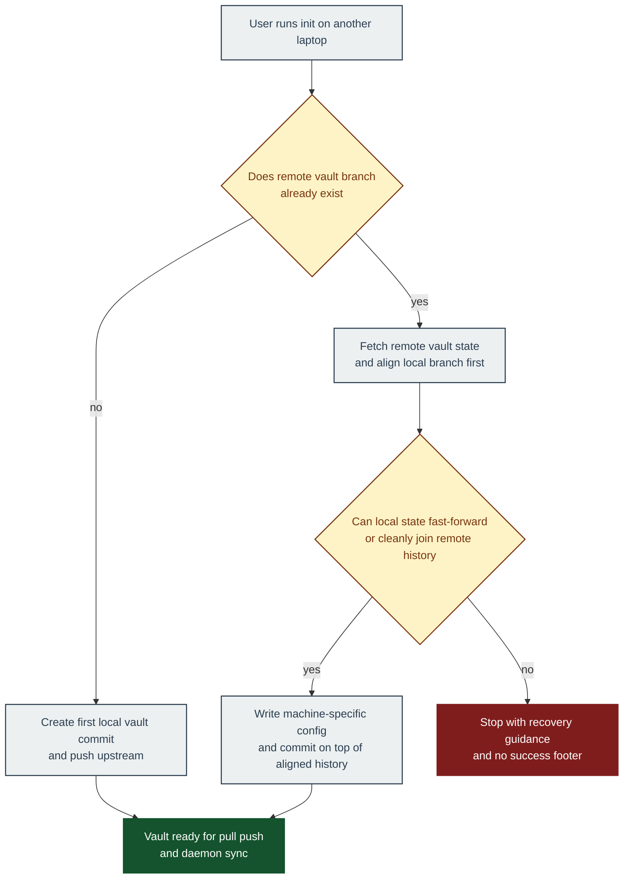

# Quickstart: Existing Vault Bootstrap Recovery

**Branch**: `20260405-223110-fix-recipient-sync` | **Date**: 2026-04-05

This guide gives reviewers a concrete way to reproduce the second-laptop failure and validate the
expected behavior after the fix.

---

## Workflow Diagram



---

## Reproduce the reported failure on current behavior

Before running this section, check out `main` or the PR base commit. The fixed branch no longer
reproduces the historical bootstrap failure by design.

1. Create a bare remote and initialize it from a first local machine:

```bash
tmp_root=$(mktemp -d)
git init --bare "$tmp_root/vault.git"

AGENTSYNC_VAULT_DIR="$tmp_root/machine-a-vault" \
AGENTSYNC_KEY_PATH="$tmp_root/machine-a-key.txt" \
AGENTSYNC_MACHINE="machine-a" \
bun run src/cli.ts init --remote "$tmp_root/vault.git" --branch main
```

1. Simulate a second laptop pointing at the same remote:

```bash
AGENTSYNC_VAULT_DIR="$tmp_root/machine-b-vault" \
AGENTSYNC_KEY_PATH="$tmp_root/machine-b-key.txt" \
AGENTSYNC_MACHINE="machine-b" \
bun run src/cli.ts init --remote "$tmp_root/vault.git" --branch main
```

1. Confirm the pre-fix failure shape:

- `init` reports an initial push failure with a non-fast-forward rejection.
- A later `pull` on the second machine reports a divergent-branch reconciliation error.
- The current CLI still prints a success-style `Pull completed: 0 agent(s) synced.` footer.

---

## Validate expected behavior after the fix

1. Repeat the same two-machine setup.
2. Confirm the second `init` joins the existing remote vault without a non-fast-forward rejection.
3. Confirm the second machine ends with a usable local vault tied to the remote `main` branch.
4. If a deliberate local divergence is created afterward, confirm `pull` exits with a controlled
   reconciliation error and does not print a success footer.
5. Run the timed `SC-002` manual check: start a 60-second timer as soon as the divergence error is
   displayed, then confirm the reviewer can identify the blocker category, the blocked sync
   action, and the required recovery action before the timer expires.
6. Confirm `push`, `key add`, or `key rotate` inherit the same reconciliation rule.

---

## Verification Commands

```bash
bun run test src/core/__tests__/git.test.ts
bun run test src/commands/__tests__/integration.test.ts
bun run check
```

---

## Reviewer Checklist

- [ ] Second-machine `init` no longer creates a divergent local-first history against an existing remote vault.
- [ ] `pull` no longer depends on user Git configuration to decide merge or rebase behavior.
- [ ] Reconciliation failures no longer emit success-style completion output.
- [ ] From the displayed divergence error, a reviewer can identify the blocker category, blocked sync action, and required recovery action within 60 seconds.
- [ ] CLI and daemon sync paths use the same shared reconciliation policy.
- [ ] The Mermaid workflow diagram matches the implemented bootstrap behavior.
