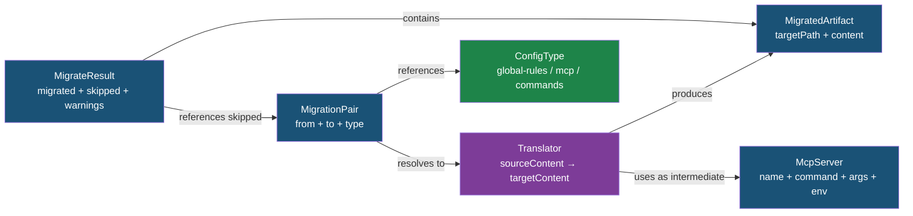

# Data Model: Cross-Agent Configuration Migration

**Feature**: `20260406-125441-config-migration`
**Date**: 2026-04-06

## Entities

### ConfigType

Enumeration of translatable configuration categories.

| Value | Description |
|-------|-------------|
| `global-rules` | Agent-wide instruction files (CLAUDE.md, AGENTS.md, instructions.md, Cursor rules string) |
| `mcp` | MCP server definitions (JSON mcpServers or TOML mcp.servers) |
| `commands` | Command/rule/prompt Markdown files (directory + extension conventions) |

**Note**: `skills` is explicitly out of scope for this feature.

### McpServer (Intermediate Representation)

Canonical shape shared by all agents' MCP configurations, used as the translation bridge between JSON and TOML formats.

| Field | Type | Required | Description |
|-------|------|----------|-------------|
| name | string | yes | Server identifier (key in mcpServers object or TOML table name) |
| command | string | yes | Executable command to run the server |
| args | string[] | no | Command-line arguments (default: []) |
| env | Record<string, string> | no | Environment variables (default: {}) |

### MigrationPair

Identifies a specific directional translation.

| Field | Type | Required | Description |
|-------|------|----------|-------------|
| from | AgentName | yes | Source agent |
| to | AgentName | yes | Target agent |
| type | ConfigType | yes | Configuration type being translated |

### MigratedArtifact

Represents a single file or config entry that was (or would be) written.

| Field | Type | Required | Description |
|-------|------|----------|-------------|
| targetPath | string | yes | Absolute destination path on disk |
| content | string | yes | Transformed content ready to write |
| description | string | yes | Human-readable summary of the transformation |

### MigrateResult

Aggregate outcome of a migration operation.

| Field | Type | Description |
|-------|------|-------------|
| migrated | MigratedArtifact[] | Successfully translated and written (or previewed) items |
| skipped | Array<{ reason: string; pair: MigrationPair }> | Items not migrated, with explanation |
| warnings | string[] | Non-fatal issues (e.g., secret redaction applied) |
| errors | string[] | Fatal issues that prevented migration |

### Translator (Function Type)

Pure function that converts source content to target format.

```
(sourceContent: string, sourceName?: string) → { content: string; targetName: string } | null
```

- Returns `null` when content is empty or untranslatable
- `sourceName` is provided for file-based types (commands) to derive the target filename
- `targetName` may be a sentinel value (e.g., `__cursor_rules__`) for inline config targets

## Relationships



## Config Type Support Matrix

Defines which (from → to) pairs have registered translators:

| From \ To | Claude | Cursor | Codex | Copilot | VS Code |
|-----------|--------|--------|-------|---------|---------|
| **Claude** | — | GR, MCP, CMD | GR, MCP, CMD | GR, CMD | MCP |
| **Cursor** | GR, MCP, CMD | — | GR, MCP, CMD | GR, CMD | MCP |
| **Codex** | GR, MCP, CMD | GR, MCP, CMD | — | GR, CMD | MCP |
| **Copilot** | GR, CMD | GR, CMD | GR, CMD | — | — |
| **VS Code** | MCP | MCP | MCP | — | — |

Legend: GR = global-rules, MCP = mcp, CMD = commands
