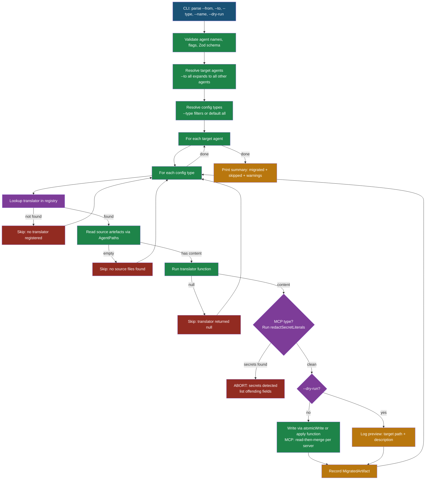

# Implementation Plan: Cross-Agent Configuration Migration

**Branch**: `20260406-125441-config-migration` | **Date**: 2026-04-06 | **Spec**: [spec.md](./spec.md)
**Input**: Feature specification from `specs/20260406-125441-config-migration/spec.md`

## Summary

Add an `agentsync migrate` command that translates configuration artefacts (global rules, MCP servers, commands) from one AI agent's format to another. Uses a translator registry pattern where each `(from, to, configType)` triple maps to a pure transformation function. Operates on local agent config files directly via `AgentPaths` — no vault dependency. MCP servers use per-server merge (preserve target-only entries). Secret detection applied to all MCP content before writing — migration aborts if secrets found (constitution Principle I).

## Technical Context

**Language/Version**: TypeScript 6.x, strict mode (`"strict": true`)
**Primary Dependencies**: citty 0.2.x (CLI), @clack/prompts 1.2.x (output), @iarna/toml 2.2.x (Codex TOML), zod 4.x (validation)
**Storage**: Local filesystem only (agent config files via `AgentPaths` from `src/config/paths.ts`)
**Testing**: `bun test` with `__tests__/` co-located directories, `*.test.ts` convention
**Target Platform**: macOS, Linux, Windows (cross-platform via `AgentPaths` platform detection)
**Project Type**: CLI tool
**Performance Goals**: N/A — one-shot command, config files are small (<100KB)
**Constraints**: No new runtime dependencies. Must not modify source agent files. Must abort on detected secret literals in MCP content (constitution Principle I). CLI arguments must be validated with Zod (constitution Principle IV).
**Scale/Scope**: 5 agents, 3 config types, 12 registered translators per type (not all pairs supported), 36 total

## Constitution Check

*GATE: Must pass before Phase 0 research. Re-check after Phase 1 design.*

### Pre-Phase 0 Evaluation

| Principle | Status | Notes |
|-----------|--------|-------|
| I. Security-First | **PASS** | FR-011 requires secret detection on MCP content; migration aborts if secrets found (not silently redacted). Aligns with constitution: "Detected secrets MUST cause the operation to abort with a clear error, not silently redact." |
| II. Test Coverage (NON-NEGOTIABLE) | **PASS** | New runtime modules (`src/migrate/`, `src/commands/migrate.ts`) require automated tests. Target ≥70% line coverage for all modules. Translators are pure functions — highly testable with fixture inputs/outputs. |
| III. Cross-Platform Daemon | **N/A** | Migration is a one-shot CLI command, not daemon-related. Uses platform-aware `AgentPaths` already. |
| IV. Code Quality (Biome) | **PASS** | No new dependencies. Zod schema for `MigrateOptions` defined in `src/config/schema.ts` for CLI argument validation. Biome formatting/linting applies automatically. |
| V. Documentation Standards | **PASS** | All exported functions require JSDoc. `docs/migrate.md` with Mermaid flow diagram required. `docs/command-reference.md` updated. |

- **Test coverage impact**: Automated tests required — this is new runtime code (translators, orchestrator, CLI command).
- **Documentation impact**: Mermaid diagram required in `docs/migrate.md` to illustrate the migration flow (read source → translate → detect secrets → write).
- **Diagram validation**: Mermaid diagram in `docs/migrate.md` must be validated before merge.

### Post-Phase 1 Re-Evaluation

| Principle | Status | Notes |
|-----------|--------|-------|
| I. Security-First | **PASS** | Research R3 confirms `redactSecretLiterals()` is applied after translation; if secrets detected, migration aborts with clear error. No data written. |
| II. Test Coverage | **PASS** | Each translator is a pure function testable with fixture strings. Orchestrator testable with mocked `readIfExists`/`atomicWrite`. Edge cases (write failure, partial failure) covered in T012. |
| IV. Code Quality | **PASS** | Zero new dependencies confirmed (R6). Zod schema for MigrateOptions in `src/config/schema.ts`. Types defined in `src/migrate/types.ts`. |
| V. Documentation | **PASS** | CLI contract in `contracts/cli-migrate.md`. Flow diagram planned for `docs/migrate.md`. Command reference updated. |

## Analysis Remediations Applied

Findings from `/speckit.analyze` session, all resolved:

| Finding | Severity | Resolution |
|---------|----------|------------|
| C1: Secret redact vs abort | HIGH | Changed to abort (constitution alignment). Updated FR-011, SC-005, R3, T012, T016. |
| C2: Read-only target edge case | MEDIUM | Added test case to T012. |
| C3: Partial failure edge case | MEDIUM | Added test case to T012. Orchestrator catches per-artefact write errors. |
| C4: source ≠ target validation | MEDIUM | Added to FR-009. Already covered in T013. |
| C5: Missing command-reference.md | MEDIUM | Added to T027 scope. |
| C6: Zod schema for CLI args | MEDIUM | Added to T002 scope. |
| C8: File path references assumption | LOW | Added to spec Assumptions. |

## Project Structure

### Documentation (this feature)

```text
specs/20260406-125441-config-migration/
├── plan.md              # This file
├── spec.md              # Feature specification
├── research.md          # Phase 0: research findings (7 decisions)
├── data-model.md        # Phase 1: entity definitions and relationships
├── quickstart.md        # Phase 1: usage guide
├── contracts/
│   └── cli-migrate.md   # Phase 1: CLI command contract
├── checklists/
│   └── requirements.md  # Spec quality checklist
└── tasks.md             # Phase 2: task breakdown (31 tasks, 8 phases)
```

### Source Code (repository root)

```text
src/
├── migrate/                          # NEW: migration feature module
│   ├── types.ts                      # ConfigType, MigrationPair, MigrateResult, Translator
│   ├── registry.ts                   # MigrationRegistry: (from, to, type) → Translator
│   ├── migrate.ts                    # performMigrate() orchestrator
│   ├── translators/
│   │   ├── global-rules.ts           # All global-rules pairwise translations
│   │   ├── mcp.ts                    # MCP translations (JSON ↔ JSON ↔ TOML)
│   │   └── commands.ts               # Command/rule/prompt file translations
│   └── __tests__/
│       ├── registry.test.ts          # Registry lookup and supported pairs tests
│       ├── migrate.test.ts           # Orchestrator tests (mocked fs)
│       └── translators/
│           ├── global-rules.test.ts  # Translator fixture tests
│           ├── mcp.test.ts           # JSON↔TOML conversion tests
│           └── commands.test.ts      # Filename convention tests
├── commands/
│   ├── migrate.ts                    # NEW: CLI command wrapper
│   └── __tests__/
│       └── migrate.test.ts           # NEW: CLI command tests
├── config/
│   └── schema.ts                     # MODIFIED: add MigrateOptions Zod schema
├── cli.ts                            # MODIFIED: register migrateCommand
├── agents/                           # UNCHANGED: existing agent adapters (read-only usage)
└── core/
    └── sanitizer.ts                  # UNCHANGED: redactSecretLiterals (read-only usage)

docs/
├── migrate.md                        # NEW: user-facing migration guide with Mermaid diagram
└── command-reference.md              # MODIFIED: add migrate command entry
```

**Structure Decision**: New `src/migrate/` module follows the existing pattern of feature-scoped directories (like `src/daemon/`). Translators are isolated in a subdirectory for maintainability as more agent pairs are added. Tests are co-located in `__tests__/` per constitution Principle II.

## Migration Flow


